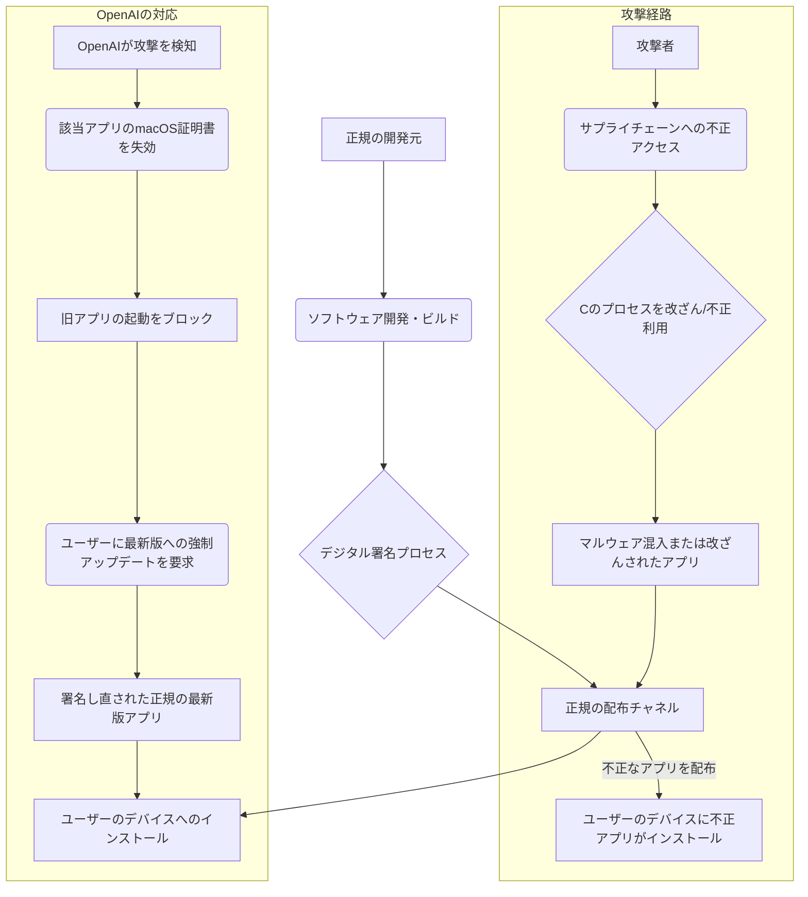

シリコンバレーで15年間、最先端の技術動向を追い続けてきた私だが、今回のニュースには少なからず衝撃を受けた。世界で最も利用されているAIツールの一つである「ChatGPTのMac版」が、まさかのサイバー攻撃の標的となり、OpenAIがユーザーに強制的なアップデートを要求する事態に発展したからだ。単なるセキュリティバグではない。ソフトウェアの「供給経路（サプライチェーン）」が狙われたこの攻撃は、AIが社会インフラとなりつつある今、私たち全員が真剣に受け止めるべき深刻な警告だと捉えている。

米メディアAppleInsiderやPCMag、9to5Macなどの報道によると、OpenAIは2026年5月14日（現地時間）、Mac向けChatGPTアプリケーションにソフトウェアサプライチェーン攻撃の痕跡を発見し、緊急措置として該当アプリのmacOS証明書を失効させた。これにより、Macユーザーはアプリの強制アップデートを余儀なくされている。この動きは、現代のAIエコシステムにおけるセキュリティの脆弱性を浮き彫りにし、企業がAIツールを導入・運用する上での新たな課題を突きつけるものだ。

## 「ChatGPT Mac版」を襲ったサプライチェーン攻撃の全貌

今回の事件は、ChatGPTのMac版アプリケーションが、ソフトウェアサプライチェーン攻撃と呼ばれる手口で標的とされたことに端を発する。通常、アプリケーションは開発者によってコードが書かれ、テストを経て、最終的にデジタル署名が施されてユーザーに配布される。このデジタル署名は、アプリが正規のものであり、改ざんされていないことを保証するものだ。しかし、サプライチェーン攻撃では、この開発から配布に至るいずれかの段階で悪意のあるコードが挿入されたり、署名プロセスが不正に利用されたりする。

OpenAIは、この攻撃を受けて、対象となるMac版ChatGPTアプリのmacOS証明書を直ちに失効させた。これは非常に強力な措置であり、該当する証明書で署名されたアプリは、macOS上ではもはや信頼できないものとみなされ、起動すらできなくなる。ユーザーがアプリを使用し続けるためには、OpenAIが新たに発行した証明書で署名された最新バージョンにアップデートするしかなくなるのだ。

この一連の動きから、今回の攻撃が単なる軽微な脆弱性ではなく、アプリの整合性やユーザーのセキュリティに直接的な影響を及ぼす可能性があったことが伺える。具体的にどのような情報が漏洩したのか、あるいはマルウェアが注入されたのかといった詳細な被害状況はまだ不明な点が多いが、OpenAIがここまで迅速かつ厳格な対応を取った事実は、事態の深刻さを物語っている。特にAIアプリの場合、ユーザーが入力するプロンプトには機密情報が含まれることも多く、その情報が悪意ある第三者に渡るリスクは計り知れない。

### なぜ「Mac版」が狙われたのか？

Web版やモバイル版もある中で、なぜ特にMac版が標的になったのかも注目すべき点だ。考えられる理由としては、デスクトップアプリはWeb版に比べてシステムにより深くアクセスできる権限を持つこと、そして、特定の開発環境やビルドプロセスに依存するため、サプライチェーンの特定のポイントが狙われやすいという側面がある。また、ChatGPTのMac版は、多くの開発者やビジネスプロフェッショナルが利用しており、彼らが扱う情報には高い価値がある。攻撃者にとって、ターゲットとして魅力的な標的だった可能性は高い。

OpenAIが発行した証明書をAppleのシステムが失効させたわけではないが、OpenAI自身が「この証明書はもう信用しない」と宣言した形だ。これは企業が自社製品のセキュリティを維持する上で、極めて重要な判断であり、同時にユーザーにとっては「常に最新の状態を保つこと」がどれほど重要かを再認識させる出来事となった。

## OpenAIの迅速な措置とAppleエコシステムの堅牢性

今回の件で、OpenAIが問題発生から証明書失効、そして強制アップデートのアナウンスに至るまで、極めて迅速に対応した点は評価されるべきだろう。ソフトウェアサプライチェーン攻撃は、発見が非常に困難であり、ひとたび発生すれば広範囲に甚大な被害をもたらす可能性がある。そのような状況下で、OpenAIが問題を早期に特定し、技術的に最も効果的な対策である証明書失効に踏み切ったことは、危機管理能力の高さを示すものだ。

macOSのセキュリティエコシステムも、このような緊急事態においてその堅牢性を発揮した。macOSのGatekeeper機能やNotarization（公証）プロセスは、アプリがAppleのセキュリティチェックを通過し、既知のマルウェアがないことを確認する仕組みだ。今回のように、一度署名されたアプリの証明書が失効された場合、OSレベルでそのアプリの実行を拒否できる仕組みがあるため、ユーザーへの被害拡大を最小限に抑えることが可能になる。これは、Appleが長年培ってきたOSセキュリティへの投資が実を結んだ形と言える。

しかし、同時にこれは、AIベンダーが提供するツールへの「信頼」が、いかにデリケートなバランスの上に成り立っているかを浮き彫りにした。ユーザーは、最先端のAI機能にアクセスできる利便性と引き換えに、自らのデータやシステムのセキュリティをベンダーに委ねている。その委託先が、サプライチェーンのどこかで狙われるリスクがあるという事実は、AIサービスの選定基準に新たな視点を加えることになるだろう。

### ユーザーデータへの影響と潜在的リスク

現時点では、今回のサプライチェーン攻撃によってユーザーの具体的なデータが漏洩した、あるいは悪用されたという確たる情報は公表されていない。しかし、攻撃の性質上、潜在的なリスクは常に存在する。例えば、改ざんされたアプリを通じて、以下のような事態が引き起こされる可能性もゼロではない。

*   **プロンプト内容の盗聴・窃取**: ユーザーがChatGPTに入力する機密性の高い質問や情報が、攻撃者に傍受される。
*   **生成された回答の改ざん**: ユーザーに表示されるChatGPTの出力が悪意ある内容に書き換えられ、誤情報拡散や詐欺行為に利用される。
*   **システムへのバックドア設置**: アプリを通じてユーザーのMacにマルウェアがインストールされ、さらなる情報窃取やシステム制御が行われる。
*   **認証情報の窃取**: アプリに保存されている可能性のあるOpenAIアカウントの認証情報が盗まれ、アカウントが乗っ取られる。

これらのリスクを考慮すると、OpenAIが強制アップデートを指示したことの重要性が改めて理解できる。ユーザーとしては、速やかに最新版へアップデートし、念のためパスワードの変更や二段階認証の設定見直しを行うなど、自衛策を講じることが賢明だ。

## なぜ「サプライチェーン攻撃」がAI時代のリスクなのか

サプライチェーン攻撃は、従来のサイバー攻撃とは一線を画する厄介な性質を持つ。標的となる企業そのものを直接攻撃するのではなく、その企業が利用するサードパーティのソフトウェアやサービス、あるいは製品の製造・流通経路に潜り込むことで、間接的に目的を達成しようとするからだ。AI時代において、この手口は特に危険な意味を持つ。

AIモデルやサービスは、しばしば複雑なオープンソースコンポーネント、サードパーティのライブラリ、クラウドサービス上に構築されている。一つのAIアプリケーションが、何百、何千もの外部依存関係を持っていることも珍しくない。攻撃者はこの広大なネットワークのどこか一点に脆弱性を見つけ、そこに悪意あるコードを忍び込ませることで、最終的なAI製品やサービス全体を汚染できるのだ。

### AIとサプライチェーン攻撃の危険な組み合わせ

1.  **信頼の連鎖の悪用**: AIサービスは、その「知性」や「信頼性」がビジネス価値の源泉となる。ユーザーがAIからの回答を盲信しやすい状況を利用し、改ざんされたAIが誤情報や偏見を拡散したり、特定の行動を誘導したりするリスクがある。
2.  **データ汚染の危険性**: AIモデルの学習データ、あるいは推論データに悪意あるデータを混入させる「データポイズニング」は、サプライチェーン攻撃と組み合わせることでより広範かつ巧妙に実行される可能性がある。これにより、AIモデルの性能が意図的に低下させられたり、特定のバイアスが組み込まれたりする恐れがある。
3.  **機密情報の直接的な標的**: AIは、企業内で大量の機密情報や個人情報を扱うことが増えている。サプライチェーンを介して攻撃者がAIツールにアクセスできれば、これらの情報が一度に窃取されるリスクが高まる。特に、APIキーや認証情報が狙われると、バックエンドのAIモデル自体が操作される可能性すらある。
4.  **影響範囲の広大さ**: ChatGPTのような広く普及したAIツールがサプライチェーン攻撃の標的となれば、世界中の数百万、数千万ユーザーに同時に影響が及ぶ可能性がある。これは、単一の企業のシステム侵害とは比較にならない規模の危機となる。

今回のOpenAIのケースは、AIベンダー自身がその開発・配布のサプライチェーンにおいて、常に最高レベルのセキュリティを維持する義務があることを痛感させるものだ。そしてそれは、エンドユーザーである私たちや企業にも、AIツールへの警戒心と適切な知識を求めるものとなる。

| 項目                 | ローカルAIアプリ (例: ChatGPT Mac版)                        | クラウドAIサービス (例: Web版ChatGPT)                 |
| :------------------- | :---------------------------------------------------------- | :---------------------------------------------------- |
| **主な攻撃経路**     | アプリのダウンロード/アップデート、サプライチェーンの脆弱性 | Webサーバーの脆弱性、APIの悪用、アカウント乗っ取り   |
| **システムへの影響** | ユーザーのデバイスに直接マルウェア注入、システムアクセス   | サーバー側のデータ漏洩、サービス停止、API悪用          |
| **ユーザーの責任範囲** | アプリのアップデート管理、OSセキュリティ、デバイス保護   | アカウントセキュリティ、強固なパスワード、二段階認証 |
| **データプライバシー** | オフライン処理が可能であればデータがデバイス外に出ない可能性あり | 原則としてデータはクラウドに保存・処理される          |
| **検知・対応の難易度** | サプライチェーンは複雑で検知が困難                      | クラウドプロバイダー側の厳重な監視体制に依存           |

## 日本企業が学ぶべき教訓と取るべき対策

今回のOpenAIのサプライチェーン攻撃は、対岸の火事ではない。日本企業、特にChatGPTをはじめとするAIツールを業務で積極的に利用している企業にとっては、極めて重要な教訓と具体的な対策を考えるきっかけとなるはずだ。

### 1. AIツールベンダーの徹底的な評価と継続的な監視

AIツールの選定において、機能や価格だけでなく、ベンダーのセキュリティ体制とインシデント対応能力を最重要視する必要がある。
*   **セキュリティポリシーの確認**: ベンダーがどのようなセキュリティ基準（ISO 27001、NISTなど）に準拠しているか、第三者監査を受けているか。
*   **サプライチェーンセキュリティの透明性**: ベンダーが利用するサードパーティ製コンポーネントやライブラリのセキュリティ対策、脆弱性管理プロセスについて情報を開示しているか。
*   **インシデント対応計画**: 万が一のサイバー攻撃発生時に、どのような対応プロトコルを持ち、ユーザーへの情報開示をどのように行うか。OpenAIのように迅速な対応ができる体制か。

### 2. 社内におけるAI利用ガイドラインの厳格化と教育

従業員がAIツールを安全に利用するための明確なガイドラインを策定し、定期的な教育を行うことが不可欠だ。
*   **最新版へのアップデート義務化**: 今回のように緊急アップデートが必要な場合、社内システムでそれを強制または強く推奨する仕組みを導入する。
*   **機密情報の取り扱い**: AIツールに入力する情報の範囲を明確に規定し、特に機密性の高い情報の入力は厳禁とする。可能であれば、社内専用のプライベートAI環境の導入も検討する。
*   **異常検知と報告体制**: 不審なアプリの挙動や通知があった場合に、速やかに情報システム部門に報告できる体制を整える。

### 3. 多層的なセキュリティ対策とゼロトラスト原則の適用

AIツールの利用に限らず、企業全体のセキュリティを再強化する必要がある。
*   **エンドポイントセキュリティの強化**: 従業員が利用するPCやモバイルデバイスには、最新のアンチウイルスソフトやEDR（Endpoint Detection and Response）ソリューションを導入し、常に監視する。
*   **ネットワーク監視の強化**: 不審な通信やデータ転送を検知できるよう、ネットワークトラフィックの監視体制を強化する。
*   **ゼロトラストネットワークの構築**: 従業員、デバイス、アプリケーションの全てを信用せず、常に認証・認可を求めるゼロトラストモデルを導入することで、サプライチェーン攻撃による内部への侵入リスクを軽減する。
*   **ソフトウェア構成分析（SCA）ツールの活用**: 自社で開発するソフトウェア、あるいは外部から導入するソフトウェアの構成要素に既知の脆弱性がないかを継続的にスキャンする。

AIは日本の生産性向上に不可欠なツールだが、その利便性の裏には常にセキュリティリスクが潜んでいる。今回の事件は、AI時代において「リスクは常に外部から来る可能性がある」というパラダイムシフトを企業に突きつけるものだ。サイバーセキュリティへの投資と意識改革は、もはやコストではなく、事業継続のための必須条件である。

## 🧐 編集部の辛口オピニオン

今回のOpenAIのサプライチェーン攻撃、日本の企業関係者はどれほど危機感を持っているだろうか？ 私の目には、「対岸の火事」と捉えている向きがまだまだ多いように映る。確かに直接的な被害はなかったかもしれない。しかし、ChatGPTのような基幹ツールが狙われ、証明書失効という強硬手段が取られた事実は、日本企業のセキュリティ意識に強烈な警鐘を鳴らすべきだ。

特に、多くの日本企業は、AIツール導入の際に機能やコストばかりに目を奪われ、「ベンダーのセキュリティ体制」や「もしもの時のインシデント対応能力」まで深く踏み込んで評価しているだろうか？ 残念ながら、その答えは「NO」であることが少なくない。特にMacユーザーは、Windowsユーザーと比較して「Macだから安全」という過信を抱きがちだが、OSの堅牢性とサプライチェーン攻撃のリスクは別次元の話だ。

「うちの会社は大丈夫だろう」という根拠のない楽観主義は、AI時代には命取りになる。日本企業は、過去のインシデントから学ぶ姿勢が決定的に不足している。世界中でどれだけセキュリティ侵害が報じられても、自社の問題として捉え、具体的な対策に落とし込むまでのスピードが遅い。

今回の件で、OpenAIがMacアプリの証明書を失効させたことで、アップデートしなければアプリが起動しなくなった。これはまさに「強制的な安全確保」だ。しかし、もしベンダーがそこまで踏み込んだ対応ができない、あるいは遅れた場合、その間にどれほどの情報が漏洩し、どれほどの損害が発生するのか、真剣にシミュレーションしている企業はどれだけあるのか。

はっきり言っておく。AIツールはもはや、単なる「便利な道具」ではない。それは企業の生命線とも言えるデータと業務プロセスに深く食い込む「基幹システム」の一部だ。そのサプライチェーンが狙われるということは、企業全体の根幹が揺らぐことを意味する。日本企業は、この現実を直視し、AI導入におけるセキュリティ評価を最優先事項として位置づけなければ、近い将来、取り返しのつかない事態に直面することになるだろう。機能競争も大事だが、まずは「安全」という土台がなければ、その上に築くものは全て砂上の楼閣に過ぎない。目を覚ませ、日本企業よ。

## 💡 よくある質問（FAQ）

### Q: 今回のChatGPT Mac版のサプライチェーン攻撃で、具体的にどのような情報が危険に晒された可能性がありますか？
A: OpenAIからは詳細な情報漏洩の報告はまだありませんが、一般的なサプライチェーン攻撃の性質上、改ざんされたアプリを通じて、ユーザーがChatGPTに入力したプロンプトの機密情報、生成された回答の内容、さらにはMacシステムへのアクセス権や認証情報などが危険に晒された可能性があります。

### Q: すでにChatGPT Mac版をインストールして利用している場合、どのような対応を取るべきですか？
A: 直ちにChatGPT Mac版を最新バージョンにアップデートしてください。OpenAIが旧版の証明書を失効しているため、アップデートしないとアプリが起動しなくなるはずです。アップデート後も、念のためOpenAIアカウントのパスワードを変更し、二段階認証を設定しているか確認することを推奨します。

### Q: サプライチェーン攻撃は、AIツール以外にも広がる可能性はありますか？
A: はい、サプライチェーン攻撃はAIツールに限らず、あらゆる種類のソフトウェアやハードウェア、さらにはクラウドサービスで発生する可能性があります。特に、多くのコンポーネツが外部から供給される現代のIT環境において、そのリスクは高まっています。今回の事件は、すべての企業が自社のITサプライチェーン全体のセキュリティを再評価するきっかけとすべきです。

## 🔗 関連ツール・サービス

**[OpenAI](https://openai.com/)** — ChatGPTなどの最先端AIモデルを開発・提供する企業。今回の事件の当事者。
**[SentinelOne](https://www.sentinelone.com/)** — AIを活用したエンドポイントセキュリティプラットフォーム。サプライチェーン攻撃のような高度な脅威にも対応。
**[Sonatype](https://www.sonatype.com/)** — ソフトウェアサプライチェーン管理とオープンソースセキュリティに特化したソリューションを提供。
**[Snyk](https://snyk.io/)** — 開発者向けのセキュリティプラットフォームで、オープンソースの脆弱性やサプライチェーンリスクを検出・修正。