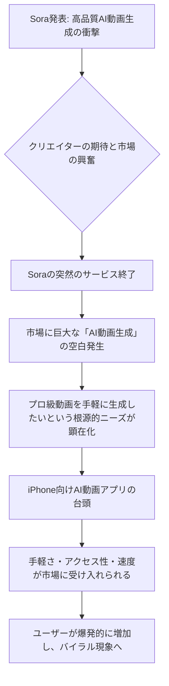

シリコンバレーでAIの動向を追い続ける私にとって、昨今の動画生成AI市場の動きは、まさに予測不能なジェットコースターのようだ。OpenAIが鳴り物入りで発表し、世界中のクリエイターや開発者の度肝を抜いた高性能動画生成AI「Sora」。その圧倒的なクオリティは、まさに「未来が来た」と誰もが確信した瞬間だった。しかし、その輝きは長くは続かず、わずか半年でSoraは表舞台から姿を消した。その衝撃は、いまだに多くの人々の記憶に新しいだろう。

だが、この「Sora不在」の混沌とした状況の中で、意外なヒーローたちが突如として現れ、急速に市場の空白を埋め始めている。それは、iPhone向けのAI動画生成アプリだ。米国のテクノロジーメディア「9to5Mac」の報道によれば、Soraの撤退後、複数のiPhone向けAI動画アプリが爆発的な人気を博し、瞬く間にバイラル現象を巻き起こしているという。これは単なる一時的なトレンドではない。Soraが切り拓いたはずの未来が、まさかの「手のひらサイズ」で、しかもはるかに身近な形で再構築されつつあるのだ。

## 「Sora」の衝撃と、その突然の終焉が残したもの

2026年初頭、OpenAIが「Sora」を発表した際の衝撃は計り知れないものがあった。テキストプロンプトから数分間の高精細な動画を生成できる能力は、これまでのAI動画生成技術の常識を覆すものだった。ハリウッドの映画製作者からインディーズクリエイターまで、誰もがSoraがもたらす「創造の民主化」に熱狂した。編集部でも、その発表を受けて、その革新性と、それが引き起こすであろう市場の激変について熱く語ったのを覚えている。

しかし、Soraのサービスは唐突に、そしてあっけなく終了した。その背景には、法規制、倫理問題、莫大な運用コスト、あるいはより高性能な次世代モデルへの移行準備など、様々な憶測が飛び交ったが、結局のところ一般ユーザーがその恩恵を受ける機会は限られていた。多くの企業がSoraのAPIへのアクセスを待ち望んでいた矢先のことだったため、その影響は甚大だった。

Soraが去った後、市場には巨大な空白が生まれた。それは、誰もが「プロ級の動画を、手軽に、迅速に、そして低コストで生成したい」という根源的なニーズだ。このニーズはSoraが火をつけ、その可能性を示したことで、むしろ一層強く意識されるようになった。まさに「百聞は一見にしかず」ではないが、Soraが「見せてしまった」ことで、人々はそのレベルの動画生成を渇望するようになったのである。そして、この「飢え」を満たすべく、意外なチャネルから新たな波が押し寄せている。

## iPhoneアプリが捉えた「Sora後」の需要：手軽さとスピード

Soraが築き上げた「未来の動画」のイメージは、その技術的な障壁の高さゆえに、一部の専門家や研究機関に限られたものだった。しかし、Soraの撤退が明らかにしたのは、その技術がどれほど革新的であったとしても、それが**一般ユーザーの手の届くところに存在しなければ、真の「民主化」は起こりえない**という冷徹な事実である。

ここに、iPhone向けAI動画アプリが成功した鍵がある。彼らは、Soraのような超高精度な動画生成を「目指す」のではなく、まずは「手軽に」「迅速に」「いつでもどこでも」動画を生成できるという、モバイルデバイスの特性を最大限に活かしたアプローチを取った。

編集部で特に注目したのは、これらのアプリが提供する**圧倒的な手軽さ**だ。複雑なプロンプト入力やレンダリング設定は最小限に抑えられ、直感的なUI/UXを通じて、まるで写真を加工するような感覚でAI動画を生成できる。例えば、数枚の写真と短いテキストプロンプトを入力するだけで、瞬時に数十秒の動画クリップが生成されるといった具合だ。TikTokやInstagram Reelsといったショート動画プラットフォームが主流の現代において、この「手軽さ」と「スピード」は、クリエイターにとって何よりも重要な要素となる。

そして、その**アクセシビリティ**も成功の大きな要因だ。PCの高性能GPUを必要とするSoraとは異なり、これらのアプリは文字通り何億台ものiPhoneにインストール可能だ。誰もが手にしているスマートフォンから、すぐにAI動画生成を始められるという手軽さは、市場の裾野を一気に広げた。複雑な設定や高価な機材を必要とせず、思い立ったらすぐにクリエイティブな表現ができる環境は、まさに「創作の敷居を下げる」ことに成功したと言える。この点は、特に日本のモバイルファーストなユーザー層に深く刺さるだろう。

## モバイルAI動画生成の技術的進化と市場構造の変化

iPhoneアプリが提供する手軽さとスピードの裏には、目覚ましい技術的進化が存在する。Soraのような超巨大モデルがクラウド上で膨大な計算資源を消費するのに対し、モバイル向けのAI動画生成アプリは、より効率的なモデルアーキテクチャや、オンデバイス処理とクラウド処理のハイブリッド戦略を採用している。

具体的には、
- **軽量化されたモデル**: スマートフォン上のNPU (Neural Processing Unit) やGPUに最適化された、よりコンパクトなAIモデルが開発されている。これにより、ローカルでの高速な推論が可能になる。
- **効率的なデータ処理**: プロンプト解釈や特徴抽出の段階で、不要な情報を削減し、必要なデータのみを効率的に処理する技術が進化している。
- **クラウドとの連携**: 生成の核となる重い処理はクラウドに任せつつ、ユーザーインターフェースや簡易的なプレビュー、初期設定などはオンデバイスで行うことで、ユーザー体験を損なわずにリソースを最適化している。
- **リアルタイム処理への注力**: 特にショート動画向けに、数秒の動画であればほぼリアルタイムで生成できるよう、生成速度に特化した最適化が進められている。

この技術進化は、動画生成AI市場の構造そのものに変革をもたらしている。かつてはごく限られた大規模AI企業が独占すると思われた市場に、アジャイルなスタートアップや独立系開発者が参入する余地が生まれてきたのだ。Soraが提示した「最高品質」の動画生成は確かに魅力的だったが、市場が本当に求めていたのは、その手前にある「十分な品質」と「圧倒的な使いやすさ」だったのかもしれない。

Soraが去ったことで、各社は特定のユースケースやターゲット層に特化したAI動画生成ソリューションの開発に注力するようになった。これにより、市場はより多様化し、特定のニッチなニーズに応えるきめ細やかなサービスが次々と登場している。

| 特性項目     | Sora (旧世代・研究指向)                 | 最新iPhone AI動画アプリ (新世代・コンシューマー指向) |
| :----------- | :---------------------------------- | :------------------------------------------- |
| **アクセス性** | 限定的 (API提供待ち、選ばれたテスター)  | 広範 (App Storeから誰でもダウンロード)           |
| **ユーザー層** | プロフェッショナル、研究者、大規模企業  | 一般ユーザー、ソーシャルクリエイター、中小企業     |
| **動画品質** | 超高精細、長尺動画対応 (数分)          | 高品質、短尺動画に特化 (数秒〜数十秒)            |
| **操作性**   | 高度なプロンプト技術要求、PCベース       | 直感的UI/UX、簡単なタップ操作、モバイル最適化     |
| **生成速度** | 長尺の場合数分〜数十分かかる可能性      | 短尺の場合数秒〜数十秒で完了、ほぼリアルタイム   |
| **コスト**   | 未定 (高額が予想された)、API課金         | 月額課金、フリーミアムモデル、手頃な価格帯       |
| **モデル規模** | 非常に大規模、クラウド集中型             | 軽量化、オンデバイス・クラウドハイブリッド型     |
| **主な用途** | 映画制作、CM制作、コンセプトアート       | SNS投稿、Vlog、プレゼンテーション素材、個人利用 |

## 日本市場への影響：クリエイターと企業の新たな挑戦

このモバイルAI動画生成アプリの台頭は、日本のクリエイティブ業界やビジネスシーンにも大きな影響を与えるだろう。日本は世界でも有数のモバイル先進国であり、SNSを通じた情報発信が非常に活発だ。これまで動画制作に敷居の高さを感じていた個人クリエイターや中小企業にとって、iPhoneひとつでプロ級の動画が生成できる環境は、まさにゲームチェンジャーとなる。

- **コンテンツ制作の加速**: インフルエンサーやVloggerは、これまで以上に迅速かつ手軽に魅力的なコンテンツを量産できるようになる。動画の企画から投稿までのサイクルが劇的に短縮され、よりタイムリーな情報発信が可能になるだろう。
- **中小企業のマーケティング強化**: 予算やリソースが限られている中小企業でも、AIを活用して高品質なプロモーション動画やSNS広告を内製できるようになる。これにより、大手企業との情報発信力の差を埋める一助となる。
- **新たなクリエイティブ表現の誕生**: 特定のスタイルやテーマに特化したAI動画アプリが次々と登場することで、日本のサブカルチャーや伝統文化を取り入れたユニークな動画コンテンツが生まれる可能性も秘めている。
- **国内開発者への機会**: 海外発のアプリが先行しているが、日本の文化やユーザーニーズに特化したAI動画生成アプリを開発するチャンスは大きい。例えば、アニメ調の動画生成や、特定の日本の風景・キャラクターに特化したモデルなど、ニッチな市場でも成功する可能性がある。

これまで動画編集は専門的なスキルと時間を要する作業だったが、AIがその障壁を劇的に引き下げた。これは、あらゆる産業における「動画化」の流れをさらに加速させると見て間違いない。テキストや静止画による情報伝達が動画に置き換わるスピードは、想像以上に速くなるだろう。

## 🧐 編集部の辛口オピニオン

Soraの夢のような技術デモに一喜一憂し、その撤退に肩を落としている日本の経営者やクリエイター諸氏に、私は敢えて厳しい言葉を投げかけたい。**大企業が提供する「完璧なソリューション」を待ち望む姿勢は、もはや時代遅れであり、致命的なリスクでしかない。**

今回のiPhone向けAI動画アプリの爆発的普及は、市場が求めているものが、必ずしも「究極の技術」ではないことを明確に示している。むしろ、「手軽に使える」「すぐに成果が出る」「手の届く価格」といった、**ユーザー中心の「実用性」**こそが、今日のAI市場における真の価値なのだ。

日本企業はこれまでも、新技術の導入に際して「様子見」の姿勢を取りがちだった。「品質が完璧になるまで」「競合の動向を見てから」といった慎重論が、ことごとくイノベーションの波に乗り遅れる原因となってきたのは、歴史が証明している。Soraの教訓は、巨大テック企業の動向すらも予測不能な現代において、一つのプラットフォームや技術に依存することの危うさを物語っている。

今、私たちがなすべきは、海外の先行事例を指を咥えて見ていることではない。目の前で起きている「モバイルAI動画」の波を、日本特有の「モバイルファースト」文化と結びつけ、**独自の価値を創出する絶好の機会**と捉えるべきだ。例えば、日本のきめ細やかなサービスやアニメ文化、あるいは特定のニッチなコンテンツ需要に応えるAI動画アプリを、迅速に企画・開発できるだろうか？

既存の動画制作会社も安穏としてはいられない。AIを敵視するのではなく、強力なツールとして取り入れ、クリエイティブの質とスピードを両立させる道を模索しなければ、あっという間に新興勢力に取って代わられるだろう。

待っていては何も始まらない。この「Soraなき後」の市場の動きは、**「行動すること」の重要性**を、私たちに突きつけている。

## 💡 よくある質問（FAQ）

### Q: Soraは本当に完全に消滅したのか、それとも将来的に再登場する可能性はあるのか？
A: OpenAIはSoraのサービス終了について具体的な理由を明かしていませんが、技術開発自体が完全に停止したわけではないと見られています。将来的には、より高度な形や、特定の企業向けソリューションとして再登場する可能性は否定できません。しかし、一般ユーザー向けの公開サービスとしての復活は現時点では不透明です。

### Q: これらのiPhoneアプリで生成される動画は、プロの動画制作にも耐えうる品質なのか？
A: 現在のiPhone向けAI動画アプリは、主にSNS投稿や個人利用、中小企業の簡易プロモーション動画など、短尺かつ迅速な生成が求められる用途で強みを発揮します。映画制作や高予算のCM制作といったプロの現場で求められるような、長尺での完璧な一貫性や精緻なコントロールにはまだ限界があります。しかし、技術進化は速く、将来的にプロのワークフローの一部に組み込まれる可能性は十分にあります。

### Q: 日本企業がこのモバイルAI動画のトレンドに乗るには何から始めるべきか？
A: まずは、市場に出回っている最新のiPhone AI動画アプリを実際に試用し、その機能、操作性、生成品質を肌で感じることが重要です。次に、自社のビジネスモデルや顧客層に合わせて、どのような動画コンテンツが有効か、AIでどこまで自動化できるかを具体的に検討します。社内でのAI活用を推進するチームを立ち上げ、パイロットプロジェクトを通じて実践的な知見を蓄積することが、この新しい波に乗るための第一歩となるでしょう。

## 🔗 関連ツール・サービス

*   **[CapCut](https://www.capcut.com/)** — モバイルに特化した高機能な動画編集アプリ。AI機能も充実しており、初心者でもプロ並みの動画が作成可能。
*   **[RunwayML](https://runwayml.com/)** — Webベースで利用できる多機能AIクリエイティブプラットフォーム。テキストから動画生成だけでなく、画像編集や様々なAIマジックツールを提供。
*   **[HeyGen](https://www.heygen.com/)** — テキストや音声からアバターを使ったプレゼンテーション動画を生成。ビジネス用途での活用が進む。
*   **[Adobe Express](https://www.adobe.com/jp/express/)** — Adobeが提供するAI搭載のオールインワンコンテンツ作成ツール。モバイルでも手軽に画像や動画、SNSコンテンツを制作できる。