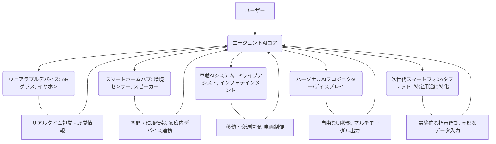

長年シリコンバレーで取材を続けてきたが、こんなに衝撃的なニュースは久々だ。2026年5月14日付のeu.36kr.comの報道が、我々に、そして世界のテクノロジー業界に激震をもたらした。「Googleはついに発見した。エージェント時代の最適なハードウェアは、もはやモバイルフォンではない」。

この一文は、モバイルインターネットの覇者として君臨し、常に「モバイルファースト」を掲げてきたGoogleの、これまでの戦略を根底から覆すものだ。一体Googleは何を見据えているのか？そして、この発言が、AIエージェントの未来、そして私たちのデバイスとの関わり方をどう変えるのか、深掘りしていく。

## Google、モバイルからの脱却を宣言

「エージェント時代」という言葉を聞くと、多くの人はまずスマートフォンを思い浮かべるだろう。強力なAIアシスタントが搭載され、私たちの日常をサポートする。しかし、Googleは今、その常識を覆そうとしている。eu.36kr.comの報道によれば、Google内部で「エージェントAIを真に機能させるための最適なハードウェアは、スマートフォンではない」という認識が共有され始めているという。

この見解は、Googleがこれまで一貫して推進してきた「モバイルファースト」戦略からの、まさにパラダイムシフトを意味する。検索、マップ、Gmail、Androidといった中核サービスが全てモバイルデバイスを中心に発展してきた歴史を鑑みれば、その重みは計り知れない。では、なぜGoogleはこのタイミングで、このような大胆な舵を切ったのか。

背景にあるのは、AIエージェントの目覚ましい進化と、それがもたらすユーザー体験の変革だ。エージェントAIとは、単なる音声アシスタントではない。ユーザーが明示的な指示を出すことなく、AIが自律的に状況を判断し、タスクを遂行し、最適な情報やサービスを先回りして提供する。例えば、フライトの遅延を察知して自動的に代替案を提案したり、会議の議事録をリアルタイムで生成し、関係者に共有したりするような、より高度な知的自動化だ。

このような「環境に溶け込むAI」を実現するには、常に手元にあるスマートフォンでは、もはや限界が見えてきたというのがGoogleの分析だろう。

## スマホでは満たせない「エージェント体験」

スマートフォンは、確かに私たちの生活の中心にある。しかし、エージェントAIが目指す「Ambient Computing（アンビエント・コンピューティング）」、すなわちAIが意識されることなく環境に溶け込み、自然な形でサービスを提供する世界においては、スマートフォンのフォームファクタにはいくつかの根本的な課題がある。

### スマートフォンが抱える限界

*   **断続的なインタラクション**: スマートフォンは、ユーザーが画面をタップしたり、特定のアプリを起動したりする「能動的な操作」によって使われることが多い。エージェントAIが目指すのは、そのような操作なしに、常にユーザーの状況を理解し、支援することだ。
*   **物理的な制約**: 画面を見る、触る、話しかける、というインタフェースが主であり、視覚、聴覚、触覚以外の感覚からの情報入力や、より自然なアウトプットには限界がある。例えば、ARグラスのような視覚的情報とリアルタイムで連携するような体験は難しい。
*   **バッテリーとプライバシー**: エージェントAIが真に機能するには、常に周囲の情報を収集し、処理し続ける必要がある。これは、現在のスマートフォンのバッテリー寿命では非現実的であり、常時録音・録画に近い状態はプライバシーの懸念を招く。
*   **用途の固定化**: スマートフォンは汎用性が高い一方で、「電話、メッセージ、カメラ、SNS」といった特定の用途に最適化されすぎており、エージェントAIが提供する多様なサービスに対応しきれない場面も出てくる。

### 新たなハードウェアへの期待

では、Googleが最適と考えるハードウェアとは具体的にどのようなものか。それはおそらく、特定の機能や環境に特化し、複数のデバイスが連携して一つの「Ambient Computing」体験を構築する方向性だろう。

考えられる候補としては、以下の点が挙げられる。

*   **ウェアラブルデバイス**: より進化したスマートグラス（ARグラス）、常時装着可能なイヤホン型デバイス、スマートウォッチなど。これらはユーザーの身体に最も近く、五感に訴えかけるインタラクションが可能だ。
*   **スマートホームハブ**: 家庭内のあらゆるデバイスと連携し、エージェントAIの中核となる存在。単なるスマートスピーカーの進化形ではなく、より高度なセンサーと処理能力を持つ。
*   **特定の作業に特化したデバイス**: オフィスでの作業支援、運転中の情報提供、屋外でのナビゲーションなど、特定のコンテキストに最適化された専用デバイス。
*   **車載AIシステム**: 移動空間自体がAIエージェントのハブとなる。

重要なのは、これらのデバイスが単独で機能するのではなく、シームレスに連携し、ユーザーが「意識しない」形でAIの恩恵を受けられることだ。

Ambient Computingの世界では、単一のデバイスが全てを担うのではなく、複数の「センサーとしてのデバイス」「出力としてのデバイス」がAIエージェントの中核と連携し、まるで空気のようにユーザーをサポートするのだ。

## Googleの描くAmbient Computingの未来

Googleは、こうした「Ambient Computing」のビジョンを以前から掲げ、様々なデバイスで試行錯誤を繰り返してきた。かつてのGoogle Glassは、その登場が早すぎたかもしれないが、視覚を通じて情報を得るARの可能性を示した。Google HomeやPixel Budsは、音声AIを環境に溶け込ませる試みだった。

これらの経験を通じて、Googleは以下の重要な教訓を得たはずだ。

*   **デバイスは「窓口」であり、主役ではない**: AIエージェントの真の価値は、そのAIの知能と自律性にある。デバイスは、そのAIとユーザーをつなぐ「インタフェース」の一つに過ぎない。
*   **自然なインタラクションの重要性**: キーボードやタッチスクリーンだけでなく、音声、視線、ジェスチャー、そして環境そのものからの入力に対応する「マルチモーダル」なインタフェースが必須となる。
*   **コンテキスト理解の深化**: ユーザーがどこにいて、何をしていて、何を求めているのかを、デバイスが収集する様々なデータからリアルタイムで理解する能力が求められる。

このGoogleの戦略転換は、彼らがもはやスマートフォンという既存の枠に囚われず、AIエージェントのポテンシャルを最大限に引き出すための「次なる形状」を模索していることを明確に示唆している。そして、その最適解は、必ずしも既存のモバイルフォンと同じ形をしているわけではない。

| 特性 / デバイス種類 | スマートフォン (既存) | 新規デバイス (想定されるエージェントハードウェア) |
| :------------------ | :------------------- | :--------------------------------------------- |
| **主な用途**        | 汎用計算、通信、エンタメ | 特定タスク支援、環境連携、自然なインタラクション |
| **インタラクション** | 画面タッチ、音声入力 | 音声、視線、ジェスチャー、環境センサー |
| **常時稼働性**      | 限定的 (バッテリー制約) | 高い (電源供給、省電力設計)                     |
| **プライバシー**    | ユーザーによる意識的制御 | 環境に溶け込むため、設計段階での配慮が不可欠   |
| **フォームファクタ** | 固定 (板状)          | 多様 (ウェアラブル、ハブ、組み込み型)           |
| **AI処理**          | オンデバイス＋クラウド | オンデバイス優先、クラウド連携                   |
| **普及の鍵**        | 利便性、アプリエコシステム | シームレスな体験、信頼性、コスト                   |

この表が示すように、AIエージェントの時代は、デバイスの役割と形態を根本から再定義する可能性を秘めている。

## エージェントAIが変えるデバイス産業の地図

Googleのこの「脱モバイル」宣言は、デバイス産業全体に大きな波紋を広げるだろう。

まず、**半導体メーカー**にとっては、新たなAIチップ開発の需要が加速する。単に高速なAI処理だけでなく、低消費電力で常時稼働し、多様なセンサーデータをリアルタイムで処理できる「エッジAIチップ」の重要性が増す。過去の記事でも触れたように、LPDDRメモリへの需要増は既に顕在化しており、NVIDIAのBlackwellのようなAIプラットフォームのメモリ要求は、コンシューマーDRAM市場にも影響を及ぼし始めている。これは、AIエージェントがエッジデバイスでより高度な処理を要求するようになった結果だ。

次に、**既存のデバイスメーカー**にとっては、チャンスと課題が入り混じる。Appleは既にVision ProでARグラス市場に参入し、オンデバイスLLMを推進している。AmazonはAlexaを通じてAmbient Computingの基盤を築いてきた。MicrosoftもXboxのように、デバイスとサービスを統合する戦略を模索している。Googleがモバイルの呪縛から解き放たれることで、これらの巨頭との競争は一層激化し、全く新しいフォームファクタやユーザー体験を提案できる企業が勝者となるだろう。

日本企業にとってはどうか。かつては家電製品で世界をリードしてきた日本だが、スマートフォンの波には乗り遅れた感が否めない。しかし、エージェントAIが求めるところは、単一のデバイス性能ではなく、**多様なセンサー技術、省電力技術、そしてそれらを連携させるシステムインテグレーション能力**だ。これらは、日本の得意分野である精密機器製造やB2Bソリューション開発で培われた強みと重なる部分がある。Ambient Computingが真の競争領域となるならば、日本企業にはまだ逆転のチャンスが残されているかもしれない。ただし、それには大胆な発想の転換と、迅速な実行力が求められる。

## 🧐 編集部の辛口オピニオン

Googleの「エージェント時代の最適ハードウェアはスマホではない」という発言、これを聞いて「ほう、ついに来たか」と膝を打ったジャーナリストもいれば、「またGoogleの絵空事か」と鼻で笑う向きもあっただろう。しかし、私がこのニュースから読み取るのは、単なる方向転換ではない。これは、**モバイルデバイスという「牢獄」からの脱獄宣言**に他ならない。

シリコンバレーの巨頭たちは、長らくスマートフォンの小さな画面と限られたバッテリー、そしてそこに乗っかるアプリという枠組みの中でAIの可能性を追求してきた。しかし、真のエージェントAI、つまり「ユーザーの意思を先読みし、意識されることなくタスクを遂行する存在」は、ポケットの中の四角い板では実現できないとGoogleは悟ったのだ。

日本のメーカーに問いたい。あなた方は未だにスマホ、PCの延長線上でAIを語りすぎてはいないか？「AI搭載スマホ」「AI PC」といった言葉遊びに終始し、既存の市場規模を食い合うことにばかり腐心していないか。Googleが示すように、「スマホの次」は、もはやスマホの高性能版ではない。AIエージェントは環境そのものになり、デバイスは単なるインタフェースの一つに過ぎないのだ。

「Ambient Computing」という言葉に浮かれ、単なるスマートスピーカーやスマートホーム機器の進化形に甘んじていては、またしても世界に後れを取るだろう。真にユーザーの意図を汲み、行動を予測し、その場の文脈を理解するAIを動かす**「目に見えない存在」**こそが、次世代のハードウェアの主役になる。そのビジョンを、日本の企業は、そして日本の経営層は持っているのか？

かつて、日本のメーカーは携帯電話のガラパゴス化を経験した。今、AIエージェントという新たな大陸が姿を現しつつある。この大陸で再び孤島となるのか、それとも、環境に溶け込むAIという、日本が本来持つ「調和」の精神と精密技術で世界をリードできるのか。正念場は今だ。

## 💡 よくある質問（FAQ）

### Q: Googleが言う「エージェント時代の最適ハードウェア」とは具体的に何を指すのか？
A: 具体的な単一のデバイスを指すわけではありません。むしろ、スマートフォンに限定されず、ウェアラブル（ARグラス、スマートイヤホン）、スマートホームハブ、車載システム、あるいは特定のタスクに特化したデバイス群が連携し、ユーザーの環境に溶け込む「Ambient Computing」を実現するエコシステムを指していると考えられます。

### Q: スマートフォンがエージェントAIにとって完全に不要になるのか？
A: 短期的に完全に不要になるわけではありません。スマートフォンは引き続き、最終的な確認、詳細な情報入力、または複合的なタスクの管理など、特定の役割で重要なインタフェースであり続けるでしょう。しかし、エージェントAIの主たるインタラクションや情報収集源ではなくなる可能性が高まります。

### Q: 日本のデバイスメーカーは、この動向にどう対応すべきか？
A: 単一デバイスのスペック競争から脱却し、多様なセンサー技術、省電力処理、そしてデバイス間のシームレスな連携を可能にするシステムインテグレーション能力に注力すべきです。Ambient Computingの視点から、特定の生活シーンや産業用途に特化したAIエージェントデバイスとそのサービスを一体で提供する戦略が求められます。

## 🔗 関連ツール・サービス

*   **[Google AI Studio](https://generativeai.google/models/studio/)** — Googleが提供する生成AIモデルを試せる開発プラットフォーム。
*   **[Amazon Alexa Developer](https://developer.amazon.com/alexa)** — AI音声アシスタント「Alexa」のスキル開発やデバイス連携を支援する開発者向けリソース。
*   **[NVIDIA Jetson Platform](https://developer.nvidia.com/embedded/jetson-platforms)** — エッジAIアプリケーションの開発と展開を可能にする組み込み型AIプラットフォーム。
*   **[Arduino 公式サイト](https://www.arduino.cc/)** — マイクロコントローラーを基盤としたオープンソースの電子プロトタイピングプラットフォームで、エッジAI開発にも活用可能。