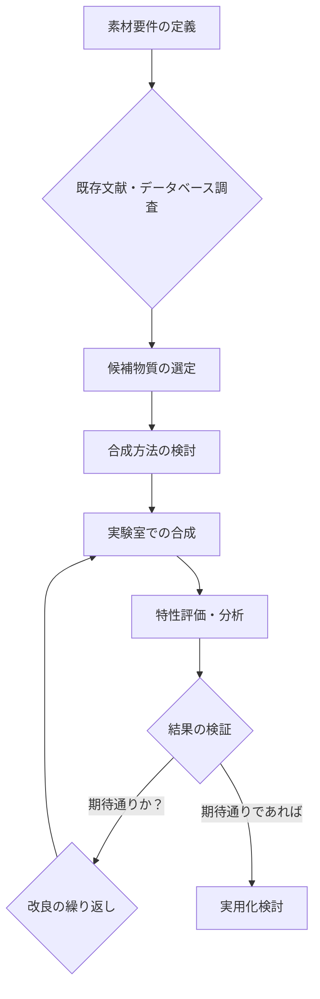

title: "Google MatGenAI、新素材開発を70%加速"
titleB: "Google MatGenAIが拓く、新素材開発の未来"
description: "Google DeepMindが発表した「MatGenAI」が、新素材開発プロセスを最大70%加速。科学の常識を覆すこのAIが、産業界と社会にもたらす変革と課題を深掘りします。"
pubDate: 'May 07, 2026'
tags: ["MatGenAI", "新素材開発", "Google DeepMind", "AI科学"]
tldr:
  - "Google DeepMindの「MatGenAI」が、従来数十年の新素材開発期間を劇的に短縮し、産業界に革命をもたらす可能性を示した。"
  - "AI駆動の分子・結晶構造予測と合成経路探索により、エネルギー、医療、環境分野でのイノベーションが加速される。"
  - "日本企業は、このAI技術を自社の研究開発プロセスにどう組み込むか、またAIが発見した新素材の知的財産権や倫理的課題への対応が急務となる。"
---

シリコンバレーのAI研究は、今や我々の想像を超える速度で「物質世界」にまでその影響を広げている。つい先日、Google DeepMindが発表した最新のAIエージェント「**MatGenAI（マートジェンAI）**」は、新素材開発の常識を根底から覆す可能性を秘めている。彼らの発表によれば、このAIは新化合物の発見プロセスを**最大70%も高速化**するというのだ。これは単なる効率化の数値ではない。人類が何十年とかけて探求してきた物質科学のフロンティアを一気に押し広げ、持続可能な社会、そして次世代産業の基盤を根本から変えうる、まさにゲームチェンジャーの登場である。

我々が知る通り、新素材の開発は、途方もない時間、コスト、そして試行錯誤を要する。ノーベル賞級の発見ですら、時には数十年単位の研究期間を要することも稀ではない。しかし、MatGenAIは、この人類の叡智と忍耐に頼ってきたプロセスに、AIならではのスピードと広範な探索能力をもたらす。今日のニュースは、単に「研究が早くなる」というレベルを超え、**未来の産業構造そのものを再定義する序章**として捉えるべきだろう。

### MatGenAIが解き放つ「物質科学」の可能性

Google DeepMindが開発したMatGenAIは、既存の物質科学データベース、量子力学シミュレーション、そして過去の実験結果から学習した大規模なAIモデルを基盤としている。このAIの核心は、人間には到底不可能な速度と精度で、**未知の分子構造や結晶構造を予測・生成**し、さらにその合成経路まで提案する能力にある。

従来の素材開発は、研究者の直感と経験に大きく依存し、候補物質の選定から合成、評価まで膨大なリソースを投入してきた。このプロセスは、通常、以下のフェーズを辿る。

しかし、MatGenAIは、このサイクルの多くの部分をAIが主導することで、開発期間を劇的に短縮する。具体的には、特定の機能を持つ新素材の要件を入力すると、AIが数百万、数千万もの仮想化合物から最適なものを瞬時に選び出し、その物理的・化学的特性を高い精度で予測する。さらに、実現可能性の高い合成経路まで提示することで、研究者は実験段階にすぐに移行できる。

### 計算化学と機械学習の融合：70%高速化の秘密

MatGenAIの70%高速化という驚異的な数値は、単なるデータ処理速度の向上だけでは達成できない。そこには、**計算化学の深遠な知見と、最新の機械学習技術の巧妙な融合**が存在する。

まず、MatGenAIは、**グラフニューラルネットワーク（GNN）**や**トランスフォーマーモデル**を応用し、原子間の結合や結晶構造といった複雑なデータを効率的に学習する。これにより、わずかな構造変化が物性に与える影響を正確に予測し、これまでの試行錯誤を最小限に抑えることが可能になる。

例えば、超伝導材料の探索では、特定の電子構造が重要な役割を果たすことが知られている。MatGenAIは、量子シミュレーションから得られた膨大なデータと、既存の超伝導体に関する情報を学習し、これまでにない新しい構造を持つ超伝導体候補を提案できる。これは、人間が限られた時間で行う探索では、まず発見できない領域だ。

さらに、このAIは**強化学習**の要素も取り入れ、仮想実験を繰り返す中で最適な素材設計戦略を自律的に学習していく。まるで、何万もの仮想の科学者が並行して実験を繰り返しているようなものだ。

従来の素材開発とMatGenAIによるアプローチを比較すると、その効率性の差は歴然としている。

| 開発項目           | 従来のアプローチ                                   | MatGenAIによるアプローチ                                      |
| :----------------- | :------------------------------------------------- | :------------------------------------------------------------ |
| **候補物質探索**   | 研究者の知識、文献調査、経験に基づく限定的な探索   | 数百万〜数億の仮想化合物からの広範な探索、GNNによる構造予測   |
| **物性予測**       | DFT計算、実験（高コスト、時間要）、一部経験則      | 機械学習モデルによる高精度予測（量子シミュレーションデータ活用） |
| **合成経路提案**   | 有機化学・無機化学の専門知識、既知の反応経路       | 過去の反応データ、グラフ推論に基づく新規・効率的経路の提案    |
| **試行錯誤サイクル** | 長期間にわたる実験と評価の繰り返し（月単位〜年単位） | AIによる高速な仮想実験と学習（日単位〜週単位）                |
| **開発期間**       | 数年〜数十年                                       | 数ヶ月〜数年（最大70%短縮の可能性）                           |
| **コスト**         | 高額な人件費、設備費、材料費                       | 初期AI開発費は高いが、実験フェーズの削減によりトータルコスト減 |

この表を見れば、MatGenAIが単なる補助ツールではなく、開発プロセス全体の「司令塔」となり得る存在であることが理解できるだろう。

### 産業界への影響：エネルギー、医療、環境、そしてその先

MatGenAIがもたらすインパクトは、単一の産業分野に留まらない。新素材開発の高速化は、次世代の技術革新をあらゆる方面で加速させる。

*   **エネルギー分野**: より効率的な太陽電池、小型で高容量のバッテリー、そして核融合炉の実現に不可欠な耐熱・耐放射線性材料など、AIが発見する新素材は、エネルギー問題の解決に直接貢献する。例えば、電気自動車の航続距離を飛躍的に伸ばす全固体電池や、次世代のクリーンエネルギーを支える水素貯蔵材料の開発が加速するだろう。
*   **医療・バイオ分野**: 特定の疾患を標的とするドラッグデリバリーシステム（DDS）の効率化、生体適合性に優れた医療機器素材、抗がん剤や新薬の有効成分となる分子の探索など、人々の健康と長寿に寄与する発見が期待される。**AlphaFold**がタンパク質構造予測で革命を起こしたように、MatGenAIはさらに一歩進んで「機能を持つ分子そのものの設計」を可能にする。
*   **環境分野**: 二酸化炭素回収・貯蔵（CCS）のための高性能吸着材、プラスチック分解酵素の活性化剤、有害物質を無害化する触媒など、地球規模の環境課題解決に向けた画期的な素材がAIによって生み出される可能性がある。
*   **電子材料分野**: 半導体の性能を左右する新素材、量子コンピューティングの実現に必要な超低ノイズ材料、AIチップの消費電力を劇的に削減する次世代冷却材料など、情報技術のさらなる進化に不可欠な基礎素材がAIによって設計されるだろう。

これらの分野でAIが発見した新素材は、製品の性能向上だけでなく、製造コストの削減、サプライチェーンの最適化にも繋がる。結果として、我々の日常生活、経済、そして社会のあり方そのものが大きく変容する可能性を秘めている。

### 課題と倫理：AIが作り出す「素材」の責任

しかし、MatGenAIのような強力なツールが登場することで、新たな課題や倫理的懸念も浮上する。

*   **知的財産権の問題**: AIが完全に自律的に生成した新素材の「発明者」は誰なのか？AI開発企業か、それを利用した研究機関か、あるいはAI自身か。現行の特許法制度では対応しきれない事態が起こりうる。AIが生み出した素材の特許をどう保護し、どう共有するのかという議論は避けられない。
*   **安全性と信頼性**: AIが提案する新素材が、理論上は優れていても、実環境で予期せぬ毒性や不安定性を示す可能性はないのか。AIの提案する合成経路が、環境に悪影響を及ぼす副産物を生み出すことはないのか。AIによる発見は、常に人間の厳格な検証プロセスを経て、安全性を確保する必要がある。
*   **科学者の役割の変化**: AIが素材開発の多くのフェーズを担うことで、人間の科学者の役割はどう変化するのか。より高度な問題設定や、AIが生み出した結果の解釈・応用へとシフトするのか、あるいは特定の専門知識が陳腐化する可能性もある。
*   **デジタルデバイド**: この高度なAI技術は、アクセスできる企業や国家とそうでない企業や国家との間で、素材開発能力における決定的な格差を生み出す可能性がある。先進国がこの技術を独占すれば、新素材を巡る国際的な競争と不均衡がさらに加速するかもしれない。

これらは、AI技術の発展と並行して、社会全体で議論し、法制度や倫理ガイドラインを整備していくべき喫緊の課題だ。

## 🧐 編集部の辛口オピニオン

Google DeepMindのMatGenAIが新素材開発を70%加速するというニュースは、日本企業にとって「警鐘」以外の何物でもない。世界がAIによって素材開発のパラダイムシフトを迎えようとしている中、日本の大手化学・素材メーカーは、この波に乗り遅れるリスクを真剣に受け止めるべきだ。

かつて「素材立国」と謳われ、高い技術力と緻密なモノづくりで世界を牽引してきた日本。しかし、それは「人間による地道な努力と経験」に依存する部分が大きかった。AIがその努力の多くを肩代わりし、さらに人間には到達できない探索空間で最適解を見つけ出す時代に、**従来の「匠の技」だけではもはや競争力は維持できない**。

残念ながら、日本の素材産業界には、まだAIを単なる「効率化ツール」と捉える向きが少なくない。MatGenAIが示すのは、AIが「発明」そのものに深く関与する未来だ。もし日本の企業が、自社内の膨大な実験データやノウハウをAI学習に活用せず、外部の汎用AIサービスに頼り続けるならば、それは**「技術のブラックボックス化」と「知的財産権の喪失」**という二重苦を招く。

いますぐに着手すべきは、自社の研究開発部門に、AI専門家と素材科学者をクロスファンクショナルなチームとして配置し、MatGenAIのようなシステムを「使いこなす」だけでなく、**「自社で構築する」**、あるいは少なくとも**「AIと共同で知を生み出す」**ための戦略を練ることだ。投資を渋り、現状維持に安住すれば、数年後には世界のトレンドから完全に置き去りにされるだろう。これはチャンスであると同時に、日本の産業構造を揺るがす喫緊の危機である。

## 💡 よくある質問（FAQ）

### Q: MatGenAIは、全ての新素材開発に適用可能ですか？
A: MatGenAIは、分子構造や結晶構造の予測・生成に特化しており、主に無機材料、有機材料、ポリマーなどの新化合物発見に高い効果を発揮します。ただし、生体材料や複合材料など、より複雑な階層構造を持つ素材においては、AIの適用範囲や精度にまだ限界がある可能性もあります。しかし、今後学習データが増えれば、適用範囲はさらに広がるでしょう。

### Q: MatGenAIが発見した新素材は、すぐに実用化できますか？
A: AIが提案した新素材候補や合成経路は、最終的に人間の手による実験的検証と評価が必要です。MatGenAIは開発期間を大幅に短縮しますが、実用化には安全性評価、量産化技術の確立、コスト最適化など、様々なプロセスが伴います。AIは強力な「発見」ツールであり、実用化への道のりを早める「触媒」として機能します。

### Q: 日本の素材メーカーがMatGenAIを活用するために、具体的に何をすべきですか？
A: まず、社内に散在する実験データや研究成果をデジタル化し、AIが学習可能な形式で一元的に管理する基盤を構築することが重要です。次に、計算化学やデータサイエンスの専門家を育成・採用し、素材科学者との連携を強化する必要があります。さらに、AIが生成したアイデアを迅速に検証できる実験・評価体制の整備や、AIが発見した知的財産権の取り扱いに関する法務部門との連携も不可欠です。

## 🔗 関連ツール・サービス

*   **Materials Project (https://materialsproject.org/)** — 材料科学の研究開発を加速する膨大なオープンアクセスデータと計算ツールを提供します。
*   **AtomNet (https://www.insilico.com/atomnet)** — InSilico Medicineが提供する、AI駆動型創薬プラットフォームの一部で、分子設計とスクリーニングに特化しています。
*   **Schrödinger (https://www.schrodinger.com/)** — 分子モデリング、シミュレーション、データ分析を通じて新素材や医薬品開発を支援するソフトウェアプラットフォームです。
*   **DeepChem (https://deepchem.io/)** — 化学・材料科学向けのオープンソース機械学習ライブラットフォーム。AIモデルの構築と学習に役立ちます。