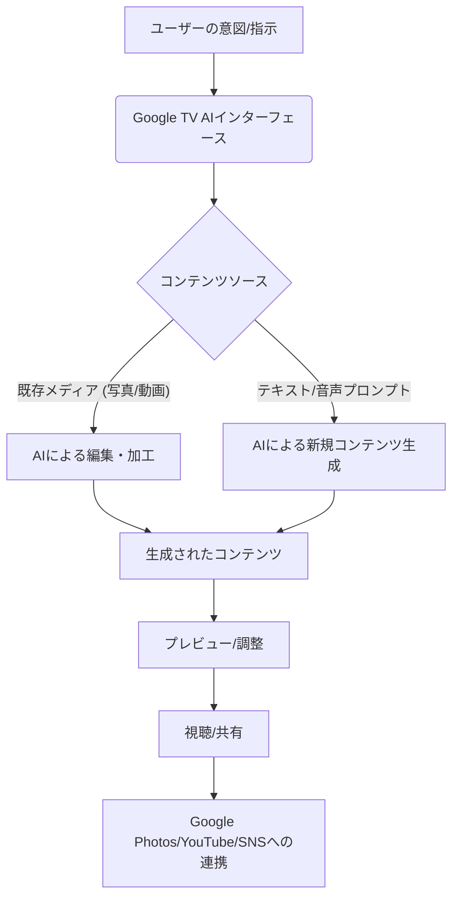

テレビはもはや、ただ映像を受信するだけの箱ではない。それは、家庭の中心で情報とエンターテインメントを司る「リビングのハブ」へと進化を遂げつつあります。しかし、その進化の速度は、多くの人々の想像を遥かに超えているかもしれません。

今回、米国のAI関連ニュースで編集部が特に注目したのは、「GoogleがGoogle TVにAI画像・動画生成機能を追加する」という報です。これは単なる機能拡張にとどまらず、私たちが家庭でコンテンツを消費し、さらには「創造する」という行為そのものに、根本的な変革をもたらす可能性を秘めています。

### Google TVの「リビング革命」：AI画像・動画生成の衝撃

これまで、スマートテレビはストリーミングサービスの視聴、ゲーム、スマートホームデバイスの管理といった受動的あるいは管理的な役割が主でした。そこに、GoogleがAIによる画像・動画生成機能を持ち込むというのです。これは、ユーザーがリビングにいながらにして、高度なAIを活用したコンテンツ創作活動に直接参加できることを意味します。

例えば、家族旅行で撮影した写真や短い動画クリップをGoogle TVに読み込ませるだけで、AIがテーマに沿ったBGM、トランジション、特殊効果を自動で加え、一つの完成されたショートムービーを生成する、といった使い方が現実的になるでしょう。あるいは、音声コマンド一つで「今日の晩ご飯のレシピ動画を作って」と指示すれば、既存の素材を組み合わせたり、ゼロから新たな映像を生成したりすることも夢ではありません。

この動きは、OpenAIのSoraが動画生成AIの可能性を示し、その後Soraの終了を乗り越えてiPhone動画アプリが次々と登場し人気を博している現状と無縁ではありません。動画生成AIは特定のクリエイター層から、より一般のユーザーへとその裾野を広げつつあります。そしてGoogleは、その一般化の最前線に「リビングルームの主役」であるテレビを据えようとしているのです。

このパラダイムシフトを理解するために、Google TVにおけるAI動画生成の基本的なワークフローを図で示しましょう。

ユーザーの意図をAIが理解し、既存の個人メディア資産やゼロからの生成を通じて、新たなコンテンツを生み出す。そして、それをリビングの大きなスクリーンで家族と楽しむ、あるいは手軽にオンラインで共有する。この一連の流れが、テレビという最も身近なデバイス上で完結するという点で、極めてインパクトが大きいのです。

### パーソナル化されたコンテンツ体験の幕開け

従来のテレビが提供してきたのは、不特定多数に向けた画一的なコンテンツでした。スマートテレビの登場でパーソナライズされたレコメンデーションは進んだものの、それはあくまで「おすすめされる」受動的な体験に留まります。しかし、Google TVのAI画像・動画生成は、これを「自分で創り出す」能動的な体験へと昇華させます。

考えてみてください。子供の運動会や卒業式の動画を、AIが最適なハイライトシーンを抽出し、感動的なBGMとテロップを自動挿入して、たった数分でプロ顔負けの記念ムービーにしてくれるとしたら？あるいは、友人を招いたホームパーティーの楽しかった瞬間を、その場でAIに数秒で編集させ、すぐに共有できるとしたら？これらは、私たちの思い出の記録方法、そして他者との共有方法を劇的に変えるでしょう。

このパーソナル化は、単なる利便性を超え、個々のユーザーの創造性を刺激します。Googleの強みは、その広大なエコシステムです。Google Photosに保存された膨大な個人資産、YouTubeの圧倒的な動画リソース、そしてGoogle Assistantによる直感的な音声操作が、Google TVのAI機能とシームレスに連携することで、他に類を見ない体験が生まれるはずです。

### 技術的背景と市場への影響

Googleがこの大胆な一歩を踏み出す背景には、同社が長年培ってきたAI技術の蓄積があります。最先端の言語モデル「Gemini」や画像・動画生成モデル「Imagen」など、Googleは基盤モデルの分野で世界をリードしています。これらの高度なAIが、Google TVという家庭用デバイスに最適化され、リアルタイムに近い処理能力で提供されることは、技術的なブレークスルーを意味します。オンデバイスAIとクラウドAIのハイブリッド活用も想定され、ユーザー体験の向上に寄与するでしょう。

この動きは、スマートテレビ市場全体に大きな波紋を投げかけます。Apple TV、Amazon Fire TV、Rokuといった競合プラットフォームは、Googleのこの戦略に対し、どのように対抗するのでしょうか。単なるコンテンツハブとしての競争から、AIを駆使した「創造の場」としての競争へと、市場の軸足が移る可能性があります。

また、エンターテインメント業界、特にテレビメーカーやコンテンツプロバイダーにとっては、新たなビジネスチャンスと同時に、既存のビジネスモデルを見直す必要性も生じるでしょう。ユーザーが自分で高品質なコンテンツを簡単に作れるようになれば、プロフェッショナルなコンテンツの価値は再定義されるかもしれません。

既存のスマートテレビ機能とGoogle TVの新しいAI機能を比較してみましょう。

| 機能カテゴリ          | 従来のスマートTV（標準機能）           | Google TV（新AI機能統合後）                           |
| :------------------ | :----------------------------------- | :----------------------------------------------- |
| **コンテンツ視聴**    | ストリーミング、ライブTV、VOD           | **ストリーミング、ライブTV、VOD、AI生成コンテンツ**       |
| **コンテンツ生成**    | 基本的に不可（外部デバイス接続で対応） | **AIによる画像・動画生成、編集、パーソナライズ**       |
| **レコメンデーション** | 視聴履歴に基づくパーソナル化           | **生成コンテンツからの学習を含む高度なレコメンデーション** |
| **デバイス連携**      | スマートホーム機器制御、ミラーリング   | **Google Photos/YouTube/Assistantとの深い連携**      |
| **操作性**            | リモコン、一部音声アシスタント         | **直感的な音声コマンドによるコンテンツ生成・編集**       |
| **ユーザー体験**      | 受動的、消費型                       | **能動的、創造型、インタラクティブ**                   |

この表が示すように、Google TVは従来の「視聴」中心の体験から、ユーザーが能動的に「創作」に参加するインタラクティブなハブへと進化するのです。

### コンテンツクリエイターとメディアの新たな機会

Google TVにおけるAI動画生成機能の登場は、プロのコンテンツクリエイターやメディア企業にとっても新たな可能性を拓きます。

まず、クリエイターはリビングの大きな画面で、より直感的にコンテンツのアイデアを試したり、プロトタイピングを行ったりできるようになるでしょう。例えば、企画中のCM案をAIでラフに生成し、家族や友人とリビングで共有しながらフィードバックを得るといった使い方も考えられます。これはクリエイティブワークフローの新たな起点となり得ます。

次に、家庭で生成されたUGC（User Generated Content）が、ソーシャルメディアやYouTubeといったプラットフォームに流れていく経路がさらに太くなることが予想されます。AIの力を借りて誰もがプロ並みの動画を簡単に作れるようになれば、動画投稿のハードルは劇的に下がり、マイクロインフルエンサーの数は爆発的に増加するかもしれません。メディア企業は、このような新たなUGCの流れをいかに取り込み、キュレーションし、あるいは自社のプラットフォームに還元するかに頭を悩ませることになるでしょう。

さらに、AIが生成する動画の「スタイルパック」や「テンプレート」を提供する新たなビジネスモデルも生まれるでしょう。特定のイベント（誕生日、結婚式、季節の行事など）に特化した高品質なAIテンプレートや、有名クリエイターが監修した動画スタイルなどを有料で提供することで、コンテンツ生成の質をさらに高めることができます。Google TVのAI機能は、単なるツールに留まらず、新たなクリエイティブエコシステムを構築する触媒となる可能性を秘めているのです。

## 🧐 編集部の辛口オピニオン

Google TVのAI画像・動画生成機能は、日本企業にとって「見るべき未来」であると同時に、強烈な警鐘だと捉えています。リビングルームという家庭の中心で、AIによる創造活動が当たり前になる時代が目前に迫っているのです。

残念ながら、日本の家電メーカーやコンテンツプロバイダーは、この流れに乗り遅れるリスクを抱えています。これまで「高画質」「高音質」「多チャンネル」といったハードウェアスペックやコンテンツ量で競ってきたテレビ市場に、突如として「AIによる創造性」という新たな価値軸が持ち込まれるからです。単にAI機能を搭載するだけでは不十分です。Googleは、写真、動画、検索、アシスタントといった自社の強力なエコシステムとTVをシームレスに統合することで、比類のない「体験」を提供しようとしています。

日本のメーカーは、自社製品が単体の家電として優れているだけでなく、いかにユーザーの日常生活、特に家族の思い出やコミュニケーションにAIを通じて深く入り込めるかを真剣に考えるべきです。例えば、家庭内の思い出データを安全に管理し、AIで加工・共有するサービスは、日本のユーザー特性に合致する可能性があります。また、日本独自の文化やイベントに特化したAI生成テンプレートやスタイルを提供することで、差別化を図る余地もあるでしょう。

日本のテレビ局やコンテンツ制作会社も、視聴率を追いかける受動的なビジネスモデルから脱却し、ユーザーがAIでコンテンツを「共創」できるようなインタラクティブなプラットフォームやサービスに投資すべきです。家庭から生まれるUGCをいかに魅力的な形で取り込み、新たな才能を発掘するか。これは、日本のコンテンツ産業が生き残るための喫緊の課題と言えます。

「テレビは見るもの」という固定観念に縛られず、「テレビで創る」という新常識にどれだけ早く適応できるか。日本のリビングルームの未来は、この変革への対応にかかっています。

## 💡 よくある質問（FAQ）

### Q: Google TVでのAI動画生成は、どのような人にとって最も有用か？
A: 主に、家族の思い出を簡単に美しい動画として残したい親世代、旅行やイベントの記録をSNSで手軽に共有したい若年層、そして高度なスキルなしに動画編集を楽しみたい初心者クリエイターに最も有用と考えられます。リビングという家族が集まる場所で、共有体験を生み出すための強力なツールとなるでしょう。

### Q: プライバシーや著作権に関する懸念は？
A: AIによるコンテンツ生成では常にプライバシーと著作権の問題が伴います。Googleは既存のGoogle PhotosやYouTubeにおけるプライバシー設定、データ利用ポリシーを基盤とし、AI生成コンテンツに対しても同様の管理体制を敷くことが予想されます。ユーザーは自身のデータがどのように利用され、生成されたコンテンツの著作権が誰に帰属するのかを明確に理解する必要があります。

### Q: 他のスマートTVプラットフォームも追随するのか？
A: Googleのこの動きは、スマートTV市場全体に大きな影響を与えるでしょう。Apple TV、Amazon Fire TV、Rokuなど、他の主要プラットフォームも、遅かれ早かれ同様のAI生成機能を統合する可能性が高いです。リビングルームにおけるAI活用は、今後のスマートTV製品の標準機能となり、各社が独自のAI技術とエコシステムを連携させて差別化を図ることになるでしょう。

## 🔗 関連ツール・サービス

**[Google フォト](https://photos.google.com/)** — AIによる写真整理・編集機能を搭載し、Google TVとの連携が期待されるサービス。
**[CapCut](https://www.capcut.com/)** — モバイルを中心に絶大な人気を誇る動画編集アプリ。豊富なAI機能で手軽に動画作成が可能。
**[RunwayML](https://runwayml.com/)** — プロフェッショナル向けのAI動画生成・編集プラットフォーム。より高度なAIクリエイティブを実現。
**[Adobe Firefly](https://www.adobe.com/jp/sensei/generative-ai/firefly.html)** — Adobeが提供する画像・動画生成AIサービス。プロ向けソフトウェアとの連携も強み。