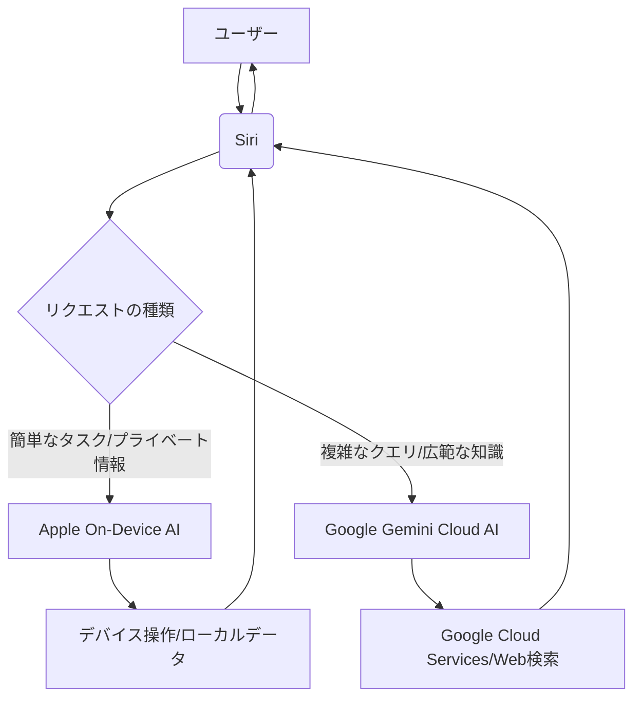

2026年5月、シリコンバレーに衝撃が走りました。これまで「自社開発、自社エコシステム」を徹底してきたAppleが、まさかの戦略転換を示唆する報道が複数飛び交っているからです。その核心は、同社の看板AIアシスタント「Siri」に、ライバルであるGoogleの高性能AIモデル「Gemini」が統合されるというもの。9to5Macが報じたこのニュースは、単なる機能強化に留まらず、AI業界全体の勢力図を塗り替え、Appleの将来戦略に大きな疑問符を投げかけるものです。

我々編集部で特に注目したのは、この提携が「なぜ今、起こるのか」という点です。長らくAppleのSiriは、その使いやすさとは裏腹に、競合のAIアシスタントに比べて知能面での立ち遅れが指摘されてきました。一方、GoogleのGeminiは、テキスト、画像、音声など多様な情報を理解し、複雑な推論を行うマルチモーダルAIとして、その進化は目覚ましいものがあります。もしこの情報が事実であれば、AppleはSiriの抜本的な改革をクラウドAIの巨人、Googleに託すという、極めて異例の決断を下したことになります。

これは「Appleはもう自社AIだけでは戦えない」という弱音の現れなのか、それとも「Siriを次世代のAIハブへと進化させるための、大胆かつ現実的な一手」なのか。本稿では、この衝撃的な動きの背景と、それがもたらす可能性、そして日本のビジネスが学ぶべき教訓について深く掘り下げていきます。

## Appleの「孤高の戦略」に変化か？SiriとGeminiの衝撃的な融合

Appleはこれまで、ハードウェア、ソフトウェア、サービスの全てを自社で設計・開発し、厳格に管理する「垂直統合型」のエコシステムを築き上げてきました。この「閉じた庭」戦略こそが、同社の製品に独自のユーザー体験と高いセキュリティをもたらし、強固なブランドロイヤリティを確立してきた源泉です。しかし、AIの進化が加速する中で、この「孤高の戦略」が新たな局面を迎えていることは、SiriとGeminiの融合の可能性が示唆しています。

Siriは2011年のiPhone 4Sでデビューして以来、多くのユーザーにとってApple製品の象徴的な存在です。しかし、近年、OpenAIのChatGPTやGoogleのGeminiといった生成AIの台頭により、Siriの機能は相対的に見劣りするようになっていました。複雑な質問への回答や文脈を理解した会話、マルチモーダルな情報処理能力において、Siriは一日の長を持つ競合に水をあけられていたのです。

Appleはこれまでも、プライバシーを重視したオンデバイスAIの研究開発を積極的に進めてきました。特に、ユーザーデータがクラウドに送信されることなく、デバイス内で処理されることで、高速なレスポンスと高いセキュリティを実現する方向性です。しかし、大規模な基盤モデルが要求する膨大な計算リソースと最新の知識ベースは、現時点でのオンデバイスAIの限界を超えているのも事実でしょう。

今回の報道は、AppleがSiriの知能を一気に引き上げるために、外部の強力なパートナー、それも最大のライバルであるGoogleの技術を取り入れるという、極めて現実的かつ戦略的な判断を下した可能性を示唆しています。これは、Appleが自社のAI戦略において、既存の「自社完結主義」に固執することなく、ユーザー体験の向上を最優先する姿勢に転換しつつあることの表れかもしれません。シリコンバレーのアナリストの間では、「Appleがついに、AI分野の競争激化に対応するため、柔軟な姿勢を見せた」という見方が支配的です。しかし、その裏には、自社開発だけでは追いつかないという焦燥感があったことも想像に難くありません。この融合が、Appleのエコシステム全体にどのような影響を与えるのか、予断を許さない状況が続いています。

## GeminiがSiriにもたらす「賢さ」の具体像

もしSiriがGeminiのインテリジェンスを取り込めば、その機能は劇的に進化するでしょう。現在のSiriが抱える「定型的なコマンド処理」の域を超え、より人間らしい、文脈を理解したインタラクションが可能になるはずです。具体的に期待される「スマートAI機能」は多岐にわたります。

まず、**より自然で複雑な会話の理解**が挙げられます。現在のSiriは、質問の意図を正確に捉えられなかったり、複数の情報を統合して回答することが苦手です。Geminiの導入により、ユーザーは曖昧な表現や回りくどい言い方でも意図を伝えられ、Siriはそれを解釈して適切な情報を引き出せるようになるでしょう。例えば、「先日予約した旅行のフライト情報を教えて。ホテルもちゃんと予約できてるか確認してほしい」といった、複数の要素を含む複雑な指示にも対応できる可能性があります。

次に、**マルチモーダルな情報処理能力の強化**です。Geminiはテキストだけでなく、画像、音声、動画といった様々な形式のデータを同時に理解し、推論することができます。これにより、Siriは単に「写真を見せて」だけでなく、「この写真に写っている場所はどこ？」「この動画の主人公が着ている服のブランドは？」といった、視覚情報に基づいた高度な質問にも答えられるようになるかもしれません。これは、現実世界の情報をAIが理解し、ユーザーの行動を先回りしてサポートする「プロアクティブなアシスタント」への進化を意味します。

さらに、**よりパーソナライズされた提案と自動化**が期待できます。Geminiは学習能力が高く、ユーザーの過去の行動履歴や好みを深く学習することで、より的確なレコメンデーションやルーティン自動化を提案できるようになるでしょう。例えば、毎日の通勤時間帯に交通情報を自動で提示したり、よく使うアプリのショートカットを先回りして表示したりといった具合です。これは、単なる「アシスタント」を超え、ユーザーのデジタルライフの「伴走者」としての役割を担う可能性を秘めています。

これらの進化は、Siriを単なる音声インターフェースから、真の「AIエージェント」へと変貌させる可能性を秘めています。Appleはこれまで、自社製チップ「Apple Silicon」によるオンデバイス処理に注力してきましたが、より高度な知能を実現するためには、クラウドの巨大な演算リソースと学習済みモデルの活用が不可欠であると判断したのかもしれません。

## 技術的背景と両社の思惑：なぜ今、この提携なのか

この驚くべき提携の背景には、AppleとGoogleそれぞれの戦略的な思惑と、現在のAI技術の進歩が複雑に絡み合っています。

まず、**Apple側の思惑**です。前述の通り、Appleはプライバシーを重視し、可能な限りデバイス内でのAI処理を目指してきました。しかし、大規模言語モデル（LLM）の進化は目覚ましく、その最新の知見や推論能力は、クラウドの大規模なデータと計算リソースに依存する側面が非常に大きいのが現状です。Appleは自社でオンデバイスLLMの開発を進めていますが、GoogleのGeminiのような最先端モデルと比較すると、知能レベルのキャッチアップには時間がかかると判断した可能性があります。ユーザー体験を最優先するAppleにとって、SiriのAI能力を早急に向上させることは喫緊の課題であり、そのためには一時的にでも外部の強力な技術を取り入れることが合理的と見なされたのでしょう。これにより、Appleは自社開発に時間を費やすことなく、Siriを次世代のAIアシスタントへと一気に引き上げる道を選んだと推測されます。

次に、**Google側の思惑**です。Googleにとって、GeminiがSiriに統合されることは、自社の最先端AI技術が世界で最も広く普及しているスマートフォンプラットフォームの一つであるiOSデバイスに搭載されることを意味します。これにより、Geminiの利用データが劇的に増加し、モデルのさらなる改善に繋がる可能性があります。また、これはGoogle AIの優位性を世界に示す絶好の機会でもあります。もしSiriがGeminiによって生まれ変われば、「AIならGoogle」というブランドイメージがさらに強化され、AI市場におけるリーダーとしての地位を盤石にするでしょう。さらに、Appleユーザーという新たな層に直接アプローチできることで、将来的にはGoogleの他のAIサービスや広告事業への誘導にも繋がる可能性も秘めています。

この提携は、技術的には「ハイブリッドAI」の未来を示唆しています。Siriのコア機能やプライバシーが厳しく要求される処理は引き続きAppleのオンデバイスAIが担い、複雑な推論や幅広い知識が必要な場合は、GoogleのクラウドベースGeminiが協調する形が想定されます。以下に、その可能性のある連携モデルを図示します。

この連携は、ユーザーのプライバシー保護とAIの高性能化を両立させる可能性を秘めていますが、潜在的な課題も存在します。例えば、データ共有の範囲、AppleとGoogle間のブランドイメージの維持、そして将来的なコントロール権の争いなどです。特に、Appleがこれまで厳格に守ってきたユーザープライバシーポリシーを、Googleとの連携においてどのように担保するのかは、最大の注目点となるでしょう。

## 競合エコシステムへの影響とAIアシスタントの未来

AppleとGoogleという、長年のライバル関係にある2大テック巨頭がSiriとGeminiで連携するとなれば、AIアシスタント市場、ひいてはテック業界全体に甚大な影響を与えることは避けられません。

まず、Amazon AlexaやMicrosoft Copilotといった競合するAIアシスタントプロバイダーは、戦略の見直しを迫られるでしょう。SiriがGeminiの知能を手に入れることで、iPhoneやiPad、Macといった膨大な数のAppleデバイスを通じて、これまで以上に高度なAI体験が普及することになります。これは、AmazonのエコシステムにおけるAlexaの地位や、MicrosoftがWindowsやOfficeに組み込むCopilotの普及戦略にも大きな影響を与えるはずです。特に、Alexaはスマートホームデバイスの中心として多くのユーザーを抱えていますが、汎用的な知能や自然な会話能力ではGemini搭載Siriにリードを許す可能性が高まります。

AIアシスタントの機能そのものも、この提携を機に大きく進化する可能性があります。これまで、各社は自社開発のAIモデルを基盤に機能競争を行ってきましたが、Appleのような企業が外部の最先端モデルを採用するという precedent ができれば、今後は「どのモデルを使うか」という選択と統合の時代が来るかもしれません。これにより、AIアシスタントは単なる音声インターフェースではなく、ユーザーの意図を汲み取り、複数のアプリやサービスを横断してタスクを完遂する真の「パーソナルエージェント」へと進化を加速させるでしょう。

他社のAI戦略にも影響は必至です。例えば、SamsungやXiaomiといったAndroidデバイスメーカーは、GoogleのGeminiを自社製品に搭載する動きをさらに加速させるでしょう。一方で、自社AIの開発に注力している企業にとっては、GoogleとAppleという2大巨頭が組んだことで、競争のハードルがさらに上がったと認識されるはずです。

今回のSiriとGeminiの統合は、AIアシスタントが単なる情報検索ツールから、ユーザーの生活に深く入り込み、積極的に支援する「デジタルブレイン」へと変貌する転換点となるかもしれません。この競争激化の波は、日本のIT企業やサービスプロバイダーにも、AI戦略の抜本的な見直しを促すことになります。

**主要AIアシスタント比較（2026年想定）**

| 特徴 \ アシスタント | 現行Siri | Gemini搭載Siri (予想) | Amazon Alexa | Microsoft Copilot |
| :------------------ | :------- | :--------------------- | :----------- | :---------------- |
| **基盤AIモデル**    | Apple独自 | Google Gemini | Amazon Alexa LLM | OpenAI GPT/Microsoft LLM |
| **知能レベル**      | 低〜中     | 高                     | 中             | 高                |
| **会話理解能力**    | 限定的     | 高度な文脈理解         | 中             | 高                |
| **マルチモーダル**  | 限定的     | 高                     | 中             | 中〜高            |
| **デバイス統合**    | Apple製品 | Apple製品              | Echoデバイス | Windows/Office    |
| **プライバシー姿勢**| 高       | 高（ただし連携の詳細に依存） | 中             | 中                |
| **主要用途**        | デバイス操作 | パーソナルエージェント | スマートホーム | 生産性向上        |

## 🧐 編集部の辛口オピニオン

今回のAppleとGoogleの提携報道は、日本のビジネスリーダーにとって、極めて重い示唆を含んでいます。正直に言って、このニュースに「え、そうなんだ」で済ませているような企業は、数年後には淘汰される危機に瀕していると断言せざるを得ません。

まず、**「自社開発主義」への過信は捨てるべき**です。世界で最も潤沢なリソースと優秀な人材を持つAppleですら、Siriの進化を早めるために、一度はライバルであるGoogleの技術に頼ろうとしている。これは「完璧なものを全て自社で作る」という幻想が、AIの急速な進化の前では現実的ではないことを示唆しています。日本の多くの企業は、「うちもAIを開発する」と意気込んでも、結局はリソース不足や技術者の枯渇で頓挫するのがオチではないでしょうか。本当に必要なのは、**自社の強みがどこにあり、どの部分を外部の最先端技術と連携させるべきか、という「戦略的アロケーション」の視点**です。プライバシーやコアバリューは自社で守りつつ、最先端の知能はパートナーシップで得る。この柔軟な発想が求められています。

次に、**「プラットフォーム戦争の終焉」という幻想も捨てるべき**です。今回の動きは、プラットフォーム間の競争が終焉したのではなく、むしろ「AIレイヤー」という新たな戦場が生まれたことを意味します。これまでiOSとAndroidというOSレイヤーで覇権を争ってきましたが、今後はそのOS上で動く「最も賢いAIアシスタント」が、ユーザーの選択を左右する決定的な要因となるでしょう。日本のサービスプロバイダーは、既存のプラットフォームに依存するだけでなく、どのAIアシスタントエコシステムに自社のサービスを深く統合していくか、という新たな「AIプラットフォーム戦略」を早急に策定しなければなりません。

さらに言えば、**「ユーザー体験の追求」がAI時代の命綱**であるという厳然たる事実です。Appleがプライドを捨ててまでSiriを強化しようとするのは、ユーザーが「より賢い、より便利なAIアシスタント」を求めていることを痛いほど理解しているからです。日本の製品やサービスは、とかく「機能性」や「技術力」をアピールしがちですが、AI時代においては、ユーザーがストレスなく、自然に、そして快適に使える「体験」こそが、競争優位性の源泉となります。どれだけ素晴らしいAI技術を持っていても、使いにくければ意味がありません。

結論として、日本のビジネスリーダーは、Appleの今回の動きを「遠いシリコンバレーの話」と傍観している場合ではありません。これは、AIが全ての産業のバリューチェーンを再定義し、企業の生存そのものに直結する時代の到来を告げる警鐘です。今こそ、自社のAI戦略を徹底的に見直し、外部との連携、そして何よりも「ユーザー中心のAI体験」の創出にコミットするべき時です。でなければ、この激流の中で、日本の企業は取り残されてしまうでしょう。

## 💡 よくある質問（FAQ）

### Q: AppleがSiriにGeminiを統合することで、ユーザーのプライバシーはどのように影響を受けますか？
A: Appleはこれまでプライバシーを非常に重視してきましたが、Gemini統合の場合、リクエストの一部がGoogleのクラウドで処理される可能性があります。Appleは恐らく、プライバシーが懸念される情報（個人情報、デバイス内の機密データなど）は引き続きオンデバイスで処理し、一般的な知識や複雑な推論を要するリクエストのみをGeminiに連携させるなど、厳格なポリシーと技術的ガードレールを設けると考えられます。具体的なデータ共有の範囲や匿名化の仕組みが、今後の発表で注目されます。

### Q: この提携が実現した場合、SiriとGoogleアシスタントはどのように差別化されるのでしょうか？
A: Gemini搭載SiriはAppleのエコシステム（iPhone, iPad, Macなど）に深く統合され、Appleのデバイスやアプリとの連携が強みとなるでしょう。一方、GoogleアシスタントはAndroidデバイスやGoogleの様々なサービス（Google検索、Gmail、Google Mapsなど）との連携に特化すると考えられます。両者ともGeminiを基盤としつつも、それぞれのプラットフォームの特性を活かした体験を提供し、異なるユーザー層にアプローチすると予測されます。

### Q: 日本語のSiriにもGeminiの機能は適用されるのでしょうか？
A: はい、その可能性は非常に高いです。Geminiは多言語に対応しており、Googleはグローバル展開を重視しています。SiriがGeminiのインテリジェンスを活用する場合、その恩恵は日本語を含む主要言語にも及ぶと考えるのが自然です。日本のユーザーにとっても、より賢く、自然な会話が可能なSiriの登場は、Apple製品の利便性を大きく向上させることに繋がるでしょう。

## 🔗 関連ツール・サービス

*   **[Google Gemini](https://gemini.google.com/)** — Googleが開発する最先端のマルチモーダルAIモデル。Siriへの統合が報じられた。
*   **[Apple Siri](https://www.apple.com/jp/siri/)** — Apple製品に搭載されているAIアシスタント。Gemini統合により大幅な機能強化が期待される。
*   **[ChatGPT](https://chat.openai.com/)** — OpenAIが開発した大規模言語モデルベースのAIチャットボット。AIアシスタント市場の競争を加速させた。
*   **[Microsoft Copilot](https://www.microsoft.com/ja-jp/microsoft-copilot)** — Microsoftが提供するAIアシスタント。WindowsやMicrosoft 365との統合で生産性向上を目指す。