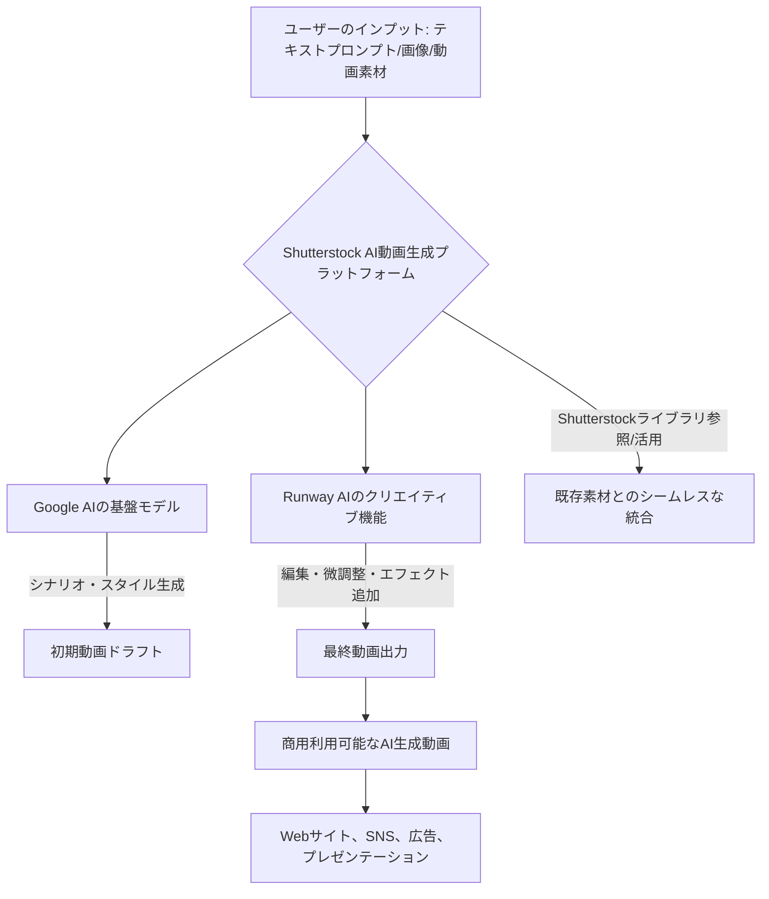

シリコンバレーから届いた速報は、これまで「プロの領域」と思われていた動画制作の世界に、新たな衝撃をもたらすだろう。ストック素材大手Shutterstockが、**GoogleとRunway AI**という二つの巨頭の技術を自社プラットフォームに統合し、**無料でAI動画生成サービスを提供する**と発表したのだ。このニュースは単なる新機能の追加ではない。膨大なクリエイティブ資産を持つShutterstockが、最先端のAI技術をテコに、動画コンテンツ市場のゲームチェンジャーとして名乗りを上げたことを意味する。

コンテンツ制作の民主化が叫ばれて久しいが、高精度な動画生成AIは未だ特定の企業やプロフェッショナルに限られた「特権」のようだった。しかし、Shutterstockのこの一手は、その壁を一気に取り払う可能性がある。一体なぜShutterstockはこのような大胆な戦略に出たのか？そして、この動きがコンテンツクリエイター、マーケター、ひいては日本のビジネス全体にどのような影響を与えるのか、深く掘り下げていきたい。

## Shutterstockの狙いと戦略的提携の全貌

ストック素材業界の老舗Shutterstockが、AI動画生成に本格参入したのは、市場の変化に対する強い危機感と、新たなビジネス機会への渇望の現れだ。彼らは単に「流行だから」とAI機能を付け加えたわけではない。その背後には、動画コンテンツ需要の爆発的増加、そしてそれに伴う制作コストと時間の高騰という、解決すべき喫緊の課題があった。

Shutterstockが今回、パートナーとして選んだのが**Google**と**Runway AI**である点は非常に興味深い。Googleは、その膨大なデータセットと研究開発力に裏打ちされた高度なAI技術を持つ。特にテキストからの画像・動画生成における自然言語処理能力や、多様なスタイルへの対応力は業界トップクラスだ。一方、Runway AIは、すでに多くのクリエイターに支持される動画編集・生成ツールを提供しており、その直感的な操作性と、映像表現の幅広さには定評がある。

この提携は、まさに**Shutterstockの持つ膨大な画像・動画ライブラリ**と、**Googleの基盤モデル技術**、そして**Runway AIの実用的なクリエイティブツール**が三位一体となったことを意味する。Shutterstockは、自社のライブラリをAI学習データとして活用することで、既存の素材と親和性の高い、商用利用に特化した動画を生成できる強みを持つ。さらに、Runway AIの直感的なUIと編集機能を統合することで、専門知識がないユーザーでも高品質な動画を短時間で作成できる環境を提供する狙いがあるだろう。

最も注目すべきは、一部の動画生成が「無料」で提供される点だ。これはShutterstockがユーザーベースを拡大し、AI動画生成を新たな「入り口」として取り込むための戦略と見られる。一度Shutterstockのエコシステムに取り込まれたユーザーは、より高度な機能や素材を求めて有料プランへ移行する可能性が高い。既存のストック素材販売だけでなく、AI生成サービスそのものを新たな収益源とする、あるいは既存事業を強化する「フック」としての位置づけだ。

### 統合モデルのメリットとワークフロー

Shutterstockが提供するAI動画生成サービスの理想的なワークフローは以下のようになるだろう。

ユーザーはテキストプロンプトを入力するだけで、Google AIが背後で動画の基本的な構造やスタイルを生成する。次に、Runway AIの技術がそのドラフトをよりクリエイティブに、そして細かく調整するためのツールを提供する。さらにShutterstockの持つ既存のストック素材を組み合わせることで、AI生成だけでは難しい、特定のシーンやイメージを容易に追加できる。これにより、非常に効率的かつ柔軟な動画制作が実現するのだ。

この統合モデルの最大のメリットは、動画制作のプロセス全体をShutterstockのプラットフォーム内で完結できる点にある。素材探しから、AI生成、編集、そして最終的なライセンス取得までが一気通貫で行えるため、これまで複数のツールやプラットフォームを行き来していたクリエイターにとっては、画期的な効率化となるだろう。

## AI動画生成市場の新たな局面：ポストSora時代の競争激化

OpenAIのSoraがその驚異的な表現力で世界を驚かせたものの、その商用利用や一般公開には依然として不透明な部分が多い。そんな中、Shutterstockのこの動きは、AI動画生成市場が「技術デモ」の段階から「実用化」そして「商用化」のフェーズへと本格的に移行していることを明確に示している。

これまでAI動画生成の主要なプレーヤーは、Runway AIやStability AI、あるいはAdobeのFirefly Videoなど、特定の技術やツールに特化した企業が中心だった。しかし、Shutterstockの参入は、ストックコンテンツという既存の強力なビジネス基盤を持つ企業が、AI技術を武器に市場に本格参入することを意味する。これは、クリエイティブ産業全体におけるAIの役割が、単なる「アシスタントツール」から「コンテンツそのものの生産者」へと進化している証左とも言える。

この動きは、他のストック素材大手や、デジタルコンテンツプラットフォームにも影響を与えるだろう。同様の提携や自社開発が加速し、AI動画生成サービスは急速にコモディティ化する可能性がある。競争の焦点は、純粋な技術力だけでなく、どれだけ多くの高品質な学習データを持ち、ユーザーにとって使いやすいインターフェースを提供し、既存のワークフローにシームレスに統合できるか、という点に移っていくはずだ。

### 競争優位を確立するための要素

| 要素            | Shutterstockの強み             | 他社との差別化ポイント                 |
| :-------------- | :----------------------------- | :------------------------------------- |
| **学習データ**  | 膨大な商用ライセンス済み素材   | 高品質で倫理的にクリアなデータセット |
| **技術基盤**    | Google AI + Runway AIの融合    | 複数の最先端技術の相乗効果           |
| **商用利用**    | 明確なライセンス体系             | 既存の枠組みでの安心感               |
| **エコシステム**| 素材提供から生成、編集まで一貫 | 制作フロー全体の効率化               |
| **ユーザー層**  | 既存のクリエイター、企業ユーザー | 広範な顧客基盤へのリーチ             |

編集部で特に注目したのは、Shutterstockが**「商用利用可能なコンテンツ」を前提としている点**だ。AI生成コンテンツの著作権や倫理的な問題が議論される中、Shutterstockのような大手企業が、自社のライセンスモデルに則ってAI生成動画を提供することは、クリエイターや企業にとって大きな安心材料となる。これは、単に動画を生成するだけでなく、それを合法的に、かつ安心してビジネスで活用したいというニーズに応えるものだ。

## コンテンツクリエイターと企業への影響：プロとアマの境界線

ShutterstockのAI動画生成サービスは、コンテンツクリエイター、特に動画制作に携わる人々にとって、**諸刃の剣**となる可能性を秘めている。

まずプラス面では、**動画制作の門戸が大きく開かれる**点が挙げられる。これまで高額な機材や専門スキルが必要だった動画制作が、テキスト入力や簡単な操作で可能になることで、個人事業主、中小企業、SNSインフルエンサーなど、多くの人々が高品質な動画コンテンツを気軽に制作できるようになる。これにより、マーケティング、教育、エンターテイメントなど、あらゆる分野で動画コンテンツの活用がさらに加速するだろう。

特に、**時間とコストの劇的な削減**は無視できない。短尺のSNS用動画、広告バナーの動画版、プレゼンテーション用のアニメーションなど、手早く量産したいコンテンツではAIの恩恵は計り知れない。アイデアさえあれば、AIがそれを具体的な映像として形にしてくれるため、クリエイターはより「創造性」や「ディレクション」といった上位概念に集中できるようになるかもしれない。

一方で、懸念材料も存在する。最も大きなものは、**「プロの仕事の価値」**への影響だ。AIが一般的な動画生成を簡単にこなせるようになると、シンプルな動画制作の単価は下落する可能性がある。プロの動画クリエイターは、AIでは再現できないような**独自のクリエイティブセンス、複雑なストーリーテリング、感情表現、細部へのこだわり、そして人間的なインタラクション**といった領域で、差別化を図る必要に迫られるだろう。AIを単なるツールとして使いこなし、自身の創造性を拡張する能力が、より一層重要になる。

企業にとっては、この動きは新たなビジネスチャンスと同時に、**社内でのコンテンツ制作体制の見直し**を迫るものとなる。外部の制作会社に依頼していた業務の一部をAIで内製化できるようになれば、コスト削減とスピードアップが期待できる。しかし、そのためには、AIツールを使いこなせる人材の育成や、AI生成コンテンツの品質管理、ブランドガイドラインとの整合性の確保といった新たな課題が発生する。

### 新時代のコンテンツ戦略と求められるスキル

*   **AIによる効率化と人間による付加価値の追求**: AIに任せられる部分は徹底的に効率化し、人間ならではの感性や戦略的思考で差別化を図る。
*   **AI生成コンテンツの品質管理**: ブランドイメージを損なわないよう、AIが生成したコンテンツの厳格なレビュー体制を構築する。
*   **プロンプトエンジニアリング能力**: AIに意図通りの動画を生成させるための、的確な指示出し（プロンプト作成）スキルが必須となる。
*   **クリエイティブディレクションの強化**: AIが「手足」となる分、どのようなコンセプトで、どのようなメッセージを伝えるかという「頭脳」の役割がより重要になる。

これらのスキルは、従来のコンテンツ制作の知識に加え、AI時代の新しいリテラシーとして、あらゆるビジネスパーソンに求められるようになるだろう。

## テクノロジーの裏側：GoogleとRunway AIの貢献

今回のShutterstockの発表は、背後にあるGoogle AIとRunway AIの技術力が不可欠だ。両社がそれぞれどのような役割を担い、このサービスを可能にしているのか、深掘りしてみる。

**Google AIの役割**:
Googleは、TransformerアーキテクチャやDiffusionモデルなど、生成AIの基盤となる技術において世界の最先端を走っている。彼らの強みは、その**莫大なデータ処理能力と、多様なモダリティ（テキスト、画像、音声、動画）を扱う統一的なモデル開発**にある。ShutterstockのAI動画生成においては、主に以下の点で貢献していると推測される。

*   **テキスト・トゥ・ビデオ（Text-to-Video）の基盤モデル**: ユーザーが入力したテキストプロンプトを解釈し、高品質な動画のフレームワークやシーケンスを生成する中核技術。Googleは既にImagen VideoやLumiereといった高性能な動画生成モデルを発表しており、その知見が活用されているだろう。
*   **スタイルとコンテンツの多様性**: Googleの持つ膨大な画像・動画データと学習アルゴリズムにより、様々なジャンルやスタイルの動画を生成できる柔軟性を提供。
*   **スケーラビリティと安定性**: 大規模なユーザーからのリクエストにも耐えうる、クラウドベースのAIインフラストラクチャを提供。

**Runway AIの役割**:
Runway AIは、長年にわたりクリエイター向けのAI動画編集・生成ツールを提供してきたパイオニアだ。彼らの技術は、直感的なインターフェースと、クリエイティブな表現を可能にする詳細なコントロールに特化している。Shutterstockへの貢献は、主に以下の点が考えられる。

*   **編集機能と視覚効果**: AIが生成した初期動画を、ユーザーがさらに洗練させるための編集ツール群。例えば、スタイル転送、背景除去、特定のオブジェクトの動きの調整など、クリエイティブな微調整を可能にする。
*   **ユーザーインターフェース（UI）/ユーザーエクスペリエンス（UX）**: AI技術を一般ユーザーが迷わず使えるよう、直感的で分かりやすい操作性を提供。クリエイターが求める機能を効率的に提供するノウハウ。
*   **リアルタイム処理とプレビュー**: 生成された動画や編集結果を素早く確認できる機能。これは、動画制作の iterative なプロセスにおいて非常に重要となる。

つまり、Google AIが「骨格と肉付け」を、Runway AIが「化粧と衣装」を担当し、Shutterstockが「舞台」を提供するような構図だ。この強力な組み合わせは、AI動画生成の品質、使いやすさ、そして商用利用の実現可能性を飛躍的に高めることになる。

### 倫理と著作権の側面

AI生成コンテンツが普及するにつれて、倫理的な側面と著作権の問題は避けて通れない。ShutterstockがGoogleとRunway AIという大手と組んだことは、この点において一定の透明性と信頼性をもたらす可能性が高い。

Shutterstockは、自社のストックライブラリをAI学習データとして活用していることを公言しており、アーティストへの補償モデルも検討している。これは、AIモデルが学習するデータの出所を明確にし、その貢献に対する正当な対価を支払おうとする姿勢の表れだ。一方で、GoogleやRunway AIが学習に用いたデータセットの透明性については、引き続き注視が必要だろう。

しかし、この動きは、AI生成コンテンツの著作権問題に対する業界の**「解答」の方向性**を示唆している。大手プラットフォームが明確なライセンス体系と補償モデルを提示することで、クリエイターは安心してAIを活用し、企業は法的なリスクを低減できる。これは、AIとクリエイティブ産業が共存・共栄していく上で不可欠なステップだ。

## 🧐 編集部の辛口オピニオン

Shutterstockの今回の発表、日本のビジネス界はこれを「海外の新しいトレンド」として傍観する余裕など、もはやない。GoogleとRunway AIという最先端の技術を引っ提げ、膨大な商用コンテンツライブラリを持つ巨人が、**「無料で動画生成」**という爆弾を投下したのだ。これはコンテンツ制作のあり方を根底から覆す「津波」であり、日本の企業は、この波にどう乗るか、あるいはどう乗りこなすか、真剣に考えるべき時だ。

正直なところ、多くの日本企業やクリエイターは、AIの進化に対して、まだまだ「守り」の姿勢に終始しているように見える。著作権や品質への懸念はもちろん理解できるが、グローバルな競争は待ってくれない。このShutterstockの動きは、海外では既に「高品質な動画コンテンツが、専門知識なく、瞬時に、しかも無料で手に入る時代」が到来しつつあることを雄弁に物語っている。

日本の広告代理店や制作会社、マーケティング部門は、この変化に対してどう対応するのか？従来の制作手法やコスト感覚が、あっという間に時代遅れになる可能性があることを直視すべきだ。AIを単なる「コスト削減ツール」としてではなく、「**新たな創造性を解き放つ手段**」として捉え、積極的に導入する企業だけが生き残る。

しかし、単にツールを導入すれば良いというものでもない。AIが生成する「平均的で無難な」コンテンツでは、飽和する情報の中で埋もれてしまう。日本企業が本当に問われているのは、**「AIに何をさせ、人間は何に集中するのか」**という戦略的なディレクション能力、そして**「AIを駆使してもなお、心に響く独自の物語を生み出せるか」**という真の創造性だ。

「うちの業界には関係ない」「まだ時期尚早だ」などと悠長に構えている暇はない。Shutterstockの動きは、グローバル市場で競争する日本の企業にとって、コンテンツ戦略の全面的な見直しを迫る、強烈な警告だと受け止めるべきだ。いますぐAI動画生成の可能性を検証し、自社のコンテンツ制作ワークフローにどう組み込むか、具体的な行動計画を立てる必要がある。でなければ、デジタルコンテンツの荒波の中で、あっという間に飲み込まれてしまうだろう。

## 💡 よくある質問（FAQ）

### ### Q: ShutterstockのAI動画生成サービスは完全に無料ですか？
A: Shutterstockの発表によると、一部のAI動画生成機能は無料で利用可能です。これはユーザーを引きつけるための戦略と考えられ、より高度な機能や商用ライセンス、追加の素材利用には有料プランやサブスクリプションが必要になる可能性が高いです。具体的な料金体系はShutterstockの公式発表で確認が必要です。

### ### Q: AI生成された動画の著作権は誰に帰属しますか？
A: Shutterstockは、自社のプラットフォームで生成されたAIコンテンツに対して、通常のストック素材と同様のライセンスを提供すると示唆しています。これは、生成された動画の商用利用を可能にし、利用者はShutterstockのライセンス規約に従ってコンテンツを利用することになります。ただし、AIが学習に用いた元のデータセットに関する著作権上の懸念は業界全体で議論が続いており、Shutterstockがどのような補償モデルを構築しているかが重要です。

### ### Q: このサービスは日本のコンテンツクリエイターにとってどのようなメリットがありますか？
A: 日本のクリエイターにとっての最大のメリットは、高品質な動画コンテンツを**低コストかつ短時間で制作できる**ようになる点です。特に、SNS広告、プロモーション動画、プレゼンテーション素材など、短尺で多くのバリエーションが必要なコンテンツ制作において、作業効率を劇的に向上させることが期待されます。これにより、アイデア実現までの障壁が下がり、より多くのクリエイティブな試みが可能になります。

## 🔗 関連ツール・サービス

*   **[RunwayML](https://runwayml.com/)** — AI動画生成、編集、視覚効果を統合したクリエイター向けプラットフォーム
*   **[Adobe Firefly](https://www.adobe.com/jp/sensei/generative-ai/firefly.html)** — Adobe製品群に深く統合された、画像・動画・テキスト生成AIファミリー
*   **[Pika Labs](https://pika.art/)** — テキストや画像から高品質な動画を生成するAIツール
*   **[ElevenLabs](https://elevenlabs.io/)** — AIによるリアルな音声合成で、動画コンテンツのナレーションを効率化
---