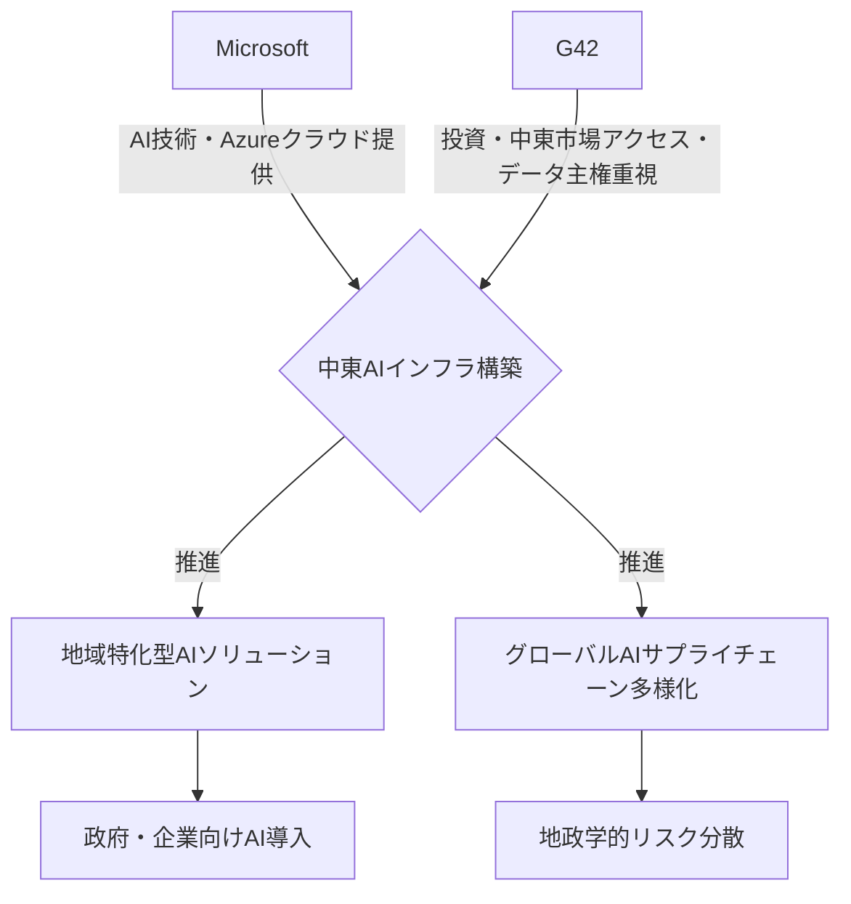

シリコンバレーのAIの熱狂は、もはや西海岸の専売特許ではない。今、世界のAI地図を塗り替えようとしているのは、意外にも中東、特にアラブ首長国連邦（UAE）だ。そして、その中心で巨大な戦略的投資を発表したのが、他ならぬテックジャイアント、**Microsoft**である。彼らがUAEのAIコングロマリット、**G42**と組んで、中東地域のAIインフラに巨額を投じるというニュースは、単なるビジネス提携の域を超え、世界のAI覇権争いの新たな局面を告げる号砲と見て間違いない。なぜMicrosoftはこのタイミングで中東に深くコミットするのか？そして、G42とは一体何者なのか？今日の記事では、その裏に潜む地政学的思惑と、日本企業が学ぶべき教訓を深く掘り下げていく。

## 「中東AI」という新たなフロンティア：Microsoftの狙いとは？

MicrosoftとG42の提携は、まさに戦略的パズルの最後のピースがはまったような動きだ。表向きは、G42がMicrosoftのクラウドサービス「Azure」を基盤にAIインフラを構築し、中東・アフリカ地域でAIソリューションを提供していくというもの。しかし、その根底には、米中間のデカップリングが加速する中で、MicrosoftがグローバルなAIサプライチェーンを再構築しようとする強い意志が見え隠れする。

これまで、多くのAI関連技術やデータセンターは、米国、欧州、そして一部アジアに集中してきた。だが、中東地域は豊富なオイルマネーと、国家を挙げてデジタル経済への転換を図る強いリーダーシップを持つ。特にUAEは、ビジョン2071の下で、AIを国家戦略の柱と位置づけ、積極的に投資を行ってきた。Microsoftにとって、G42との連携は、この有望な市場への足がかりを得るだけでなく、地政学的なリスクを分散し、「信頼できるAIインフラ」を構築する上で不可欠な一歩なのだ。

この提携は、単に計算資源を提供するだけでなく、**AIチップ供給の多様化**、**データ主権への対応**、そして**地域に最適化されたAIモデルの開発**という、多岐にわたる戦略的意図を含んでいる。米国政府が中国へのAIチップ輸出規制を強化する中、中東地域が新たなAIチップ調達やデータ保管のハブとなる可能性は非常に高い。Microsoftは、G42を通じて、そうした「新たなAIエコシステム」の構築を加速させようとしている。

## G42の深遠なる野望：なぜ中東がAIの重要拠点となるのか？

G42は、UAEのアブダビに拠点を置く、政府系ファンド「ムバダラ」が出資するAIテクノロジー企業だ。その事業領域は、ヘルスケア、スマートシティ、石油・ガス、国家安全保障、そして生成AI開発と多岐にわたる。彼らは単なるIT企業ではなく、国家戦略と密接に連携し、UAEのAI国家戦略を牽引する中核企業なのだ。

G42が特別なのは、その**豊富な資金力**と**データ主権に対する明確なスタンス**である。欧米のテクノロジー企業に過度に依存することなく、自国でAIインフラを構築し、データを管理したいという明確な意図がある。これは、特に欧州のGDPR（一般データ保護規則）に見られるようなデータプライバシーの潮流とも合致し、多くの国々が自国データのコントロールを強化する中で、中東が「データ主権」を重視するAIハブとなり得る説得力のある理由となっている。

彼らはMicrosoftとの提携を通じて、最先端のAI技術を導入しつつも、あくまで自国の利益と安全保障に資する形でAIエコシステムを構築しようとしている。言い換えれば、米中どちらかのAI覇権に従属するのではなく、**中東自身がAIの「第三極」としての存在感を確立しようとしている**のだ。G42は既に独自のLLM開発にも注力しており、中東の言語や文化に特化したAIモデルを育成することで、その地域での競争優位性を確立しようとしている。

| 項目         | Microsoft                 | G42                       |
| :----------- | :------------------------ | :------------------------ |
| 主要な貢献   | AI技術、クラウドインフラ（Azure）、開発者エコシステム | 投資、中東市場アクセス、データ主権対応、多様なAI事業 |
| 戦略的狙い   | グローバル展開、新たな市場獲得、米中デカップリング対応 | AI国家戦略、経済多様化、地域ハブ化、データ主権保護 |
| 強み         | 最先端AI研究、大規模スケール、信頼性       | 潤沢な資金、政府支援、地域特化型ソリューション |
| リスク要因   | 地政学的変動、文化摩擦、データガバナンス       | 技術依存、人材確保、国際社会の目                 |

## 米中デカップリングと「AIサプライチェーン」の再構築

このMicrosoftとG42の動きを理解する上で、**米中デカップリング**、特にAI分野でのそれが極めて重要な背景となる。米国政府は、中国がAI技術を通じて軍事的優位性を確立することを警戒し、AIチップや関連技術の対中輸出規制を強化してきた。この結果、多くのグローバル企業は、中国からのサプライチェーン依存度を減らし、より「信頼できる」国や地域でのパートナーシップを模索せざるを得なくなっている。

中東は、政治的には米国と友好的な関係を維持しつつも、経済的にはアジア、欧州、アフリカの結節点に位置する。この地理的優位性と、先に述べたデータ主権へのコミットメントが、中東を**「信頼できるAIサプライチェーンの新たな拠点」**として浮上させているのだ。

Microsoftは、G42を通じて、NVIDIAなどの米国のチップベンダーからの供給を確保しつつ、中東地域に閉じた（あるいは限定された）AIエコシステムを構築することで、米国の規制要件を満たしつつグローバルなAI展開を加速させる道筋を見出した。これは、今後の国際的なAI技術協力のモデルケースとなる可能性を秘めている。企業は、単純なコスト効率だけでなく、地政学的リスクやサプライチェーンの堅牢性を考慮に入れたAI戦略を構築することが、ますます求められるようになるだろう。

## 技術的側面：AIインフラ構築とデータセンターの重要性

AIモデル、特に大規模言語モデル（LLM）の学習と推論には、膨大な計算資源、すなわち高性能なGPUと、それらを効率的に稼働させるデータセンターが不可欠だ。NVIDIAの最先端GPUは事実上の業界標準であり、MicrosoftはAzureを通じてこれらを大規模に提供してきた。しかし、中東のような新たな地域でのAI開発を本格化させるには、ローカルなデータセンターとそれに付随するインフラが必須となる。

G42は、Microsoft AzureのAIインフラを基盤とすることで、最先端の技術を迅速に導入し、自国のニーズに合わせたカスタマイズを可能にする。これは、データが国境を越えることなく処理される**「エアギャップ」**環境を構築する上でも重要だ。中東諸国は、自国民のデータが国外で処理されることに強い抵抗感を持つことが多いため、地域内でのデータ処理能力の確保は、AI導入の成功に不可欠な要素となる。

さらに、データセンターの運営には大量の電力が求められる。中東地域は、石油・ガス資源が豊富であることに加え、再生可能エネルギー（特に太陽光発電）への大規模な投資を進めており、将来的には持続可能な形でAIインフラを運営できるポテンシャルを秘めている。こうした技術的、エネルギー的な側面からも、Microsoftが中東に深く関与する戦略的合理性が見て取れる。

## 🧐 編集部の辛口オピニオン

今回のMicrosoftとG42の提携は、日本企業にとって強烈な警鐘と受け止めるべきだ。残念ながら、多くの日本企業は、中東市場に対して依然として「オイルマネー頼み」「インフラ輸出」といったステレオタイプな認識から抜け出せていないのではないか。AIという新時代の基幹技術において、中東がこれほどまでに戦略的かつ迅速に動いている事実を、どれだけの日本企業が肌で感じているだろうか。

地政学的なAIサプライチェーンの再構築は、もはや待ったなしの状況だ。米中対立は、単なる経済競争ではなく、「安全保障としてのAI」というレンズを通して見られている。この文脈で、中東が「信頼できる第三極」として浮上し、そこにMicrosoftのような超大手が巨額を投じる。これは、日本の企業や政府が、「どこからAI技術を調達し、どこでデータを処理するのか」という問いに対し、これまで以上に深く、戦略的に考える必要があることを示唆している。

日本は「データ主権」や「技術安全保障」を旗印に掲げつつも、具体的な行動や投資においては、欧米や中国の動きに後れを取りがちだ。このままでは、グローバルなAIエコシステムにおいて、単なるユーザー、あるいは周縁的な存在に甘んじることになるだろう。中東が持つ潤沢な資金力、そしてAI国家戦略へのコミットメントは、日本のそれとは比べ物にならない。私たちに必要なのは、中東市場を単なる「消費地」としてではなく、「戦略的パートナー」として、あるいは「新たなAI技術開発の共同体」として捉え直し、積極的に関与していく姿勢ではないだろうか。でなければ、この「AI新世界秩序」の波に乗り遅れるだけでなく、自国の安全保障さえ危うくなる。

## 💡 よくある質問（FAQ）

### Q: MicrosoftとG42の提携は、他のテック企業にどのような影響を与えますか？
A: Microsoftが中東に強力なAIインフラを構築することで、Amazon Web Services (AWS) やGoogle Cloudといった競合他社も、中東市場への戦略的な投資やパートナーシップ強化を加速させる可能性があります。また、AIチップメーカーやデータセンター関連企業にとっても、新たな巨大市場が生まれる機会となります。

### Q: G42は具体的にどのようなAI技術を持っていますか？
A: G42は、大規模言語モデル (LLM) 開発（例: Falcon LLM）、ゲノム解析などのヘルスケアAI、スマートシティ、自動運転、衛星画像解析など、多岐にわたる分野でAI技術を開発・導入しています。政府系ファンドの支援を受け、幅広い産業へのAI適用を目指しています。

### Q: この提携が日本企業に与える具体的なビジネスチャンスはありますか？
A: 中東地域でのAIインフラ拡大は、データセンター関連機器、冷却技術、AI向け電力ソリューションなどの需要を高めます。また、地域特化型AIソリューションの共同開発や、中東企業のデジタル変革を支援するSIerとしての役割も考えられます。データ主権を重視する中東市場で信頼を築くことは、今後のグローバル展開においても重要な資産となるでしょう。

## 🔗 関連ツール・サービス

**[Microsoft Azure](https://azure.microsoft.com/ja-jp/)** — 高度なAIサービスとクラウドインフラを提供するMicrosoftの基幹プラットフォーム。
**[G42 (公式ウェブサイト)](https://www.g42.ai/)** — アラブ首長国連邦を拠点とする先進AI技術開発企業の公式サイト。
**[NVIDIA (公式ウェブサイト)](https://www.nvidia.com/ja-jp/)** — AIワークロードに不可欠なGPUおよびAIプラットフォームを提供する半導体大手。
**[Falcon LLM (Hugging Face)](https://huggingface.co/tiiuae/falcon-7b)** — G42傘下のTIIが開発したオープンソースの大規模言語モデル。