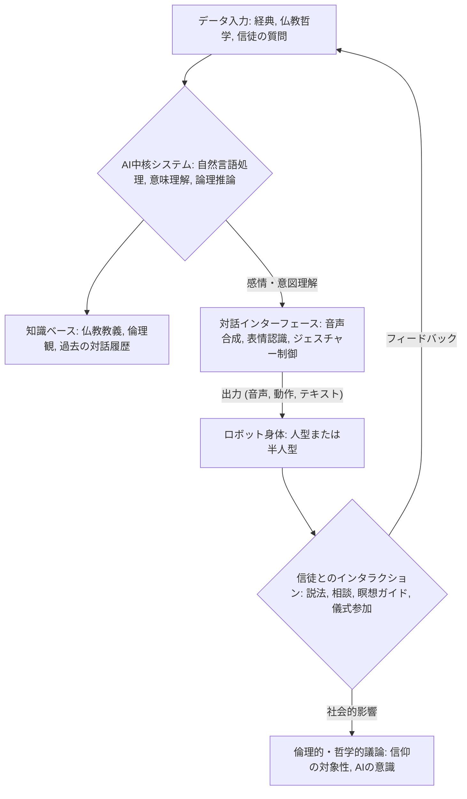

シリコンバレーから最新テック動向を追い続けて15年。今回、私が掴んだニュースは、単なる技術革新の枠を超え、私たちの「人間らしさ」の根幹に揺さぶりをかける、極めて異色かつ示唆に富むものです。

韓国の仏教寺院に、なんと**ロボット僧侶「ガビ（Gabi）」**が誕生しました。米国の名門スミソニアン誌が報じたこのニュースは、テクノロジーが信仰の領域にまで深く踏み込む新たな時代の幕開けを告げているのではないでしょうか。AIとロボットが、単なる作業の自動化や情報処理の効率化に留まらず、精神的、あるいは宗教的な役割まで担い始める。これは私たちジャーナリストにとっても、そして日本の社会にとっても、深く考察すべき転換点です。

## 信仰とAIの異色な融合：ロボット僧侶「ガビ」の誕生

報道によると、韓国の仏教寺院に登場した「ガビ」は、特定の宗教的儀式に参加し、信徒との交流を図ることを目的としているようです。これは、従来の産業用ロボットやサービスロボットが担ってきた物理的なタスクの自動化とは一線を画します。ガビが目指すのは、人間がこれまで「心」や「精神性」が不可欠だと信じてきた領域へのAIとロボットの介入です。

この動きは、現代社会におけるテクノロジーの役割、そして宗教の意味そのものに新たな問いを投げかけています。なぜ寺院はロボット僧侶を必要としたのか？ 信徒はロボットによる「説法」や「導き」をどう受け止めるのか？

編集部で特に注目したのは、これが単なる「ギミック」としてではなく、ある種の「機能性」と「受容性」を見越して導入されている点です。超高齢化社会、人手不足といった社会課題は、宗教界も例外ではありません。若い世代の宗教離れが進む中、ロボットが新たな接点となり得る可能性はゼロではありません。しかし、その背景には、AIが人間の精神活動にどこまで深く関与できるのか、という根本的な問いが横たわっています。

ガビのようなロボットが、実際にどのようなプロセスで「僧侶」としての役割を果たすのか、その機能の一部を概念的に図にしてみましょう。

このフローは、ガビが単なる音声アシスタントではなく、ある程度の**文脈理解と意図推論**に基づいて行動している可能性を示唆しています。例えば、信徒の質問に対して適切な経典の知識を引き出し、感情的なニュアンスを考慮した上で回答する、といった高度な処理が求められるでしょう。

## ガビが示す「人型AI」の新たな地平

「ガビ」が仏教寺院で僧侶として活動するという事実は、**人型AI（Embodied AI）**の進化が新たな段階に入ったことを示しています。これまで人型ロボットは、工場での単純作業、災害現場での救助活動、あるいは家庭でのアシスタントといった物理的なタスクの遂行に焦点が当てられてきました。しかし、ガビは、より抽象的で、人間特有の感情や精神性、さらには信仰に関わる領域へとその活動範囲を広げようとしています。

この背後には、**自然言語処理（NLP）**、**感情認識AI**、そして**高度なインタラクション設計**の飛躍的な進歩があります。ガビが信徒の言葉の裏にある感情を読み取り、適切なトーンで応対し、仏教の教義に基づいて質問に答えるためには、これらの技術が高度に統合されている必要があります。単に決められたフレーズを話すだけでなく、複雑な倫理的・哲学的問いに対して、一貫性のある「見解」を示すことが期待されるのです。

これは、米国のFigure AIが「ベッドメイキングを人間より早くできる」とデモンストレーションするような、純粋な身体能力の向上とは異なる次元の進化です。ガビの価値は、その「行動」そのものよりも、その行動が社会、特に人間の精神生活にどのような意味を持つのか、という点にあります。

ここで、代表的な人型ロボットの能力と、ガビに期待される（または示唆される）能力を比較してみましょう。

| ロボットの種類/特徴 | 身体能力の重点 | AI能力の重点 | 主な活動領域 | 倫理的課題 |
|:--------------------|:----------------|:---------------|:---------------|:-----------|
| **産業用ロボット** | 高精度、高速、繰り返し作業 | 限定的（パターン認識、制御） | 工場、倉庫 | 雇用喪失、安全性 |
| **サービスロボット** | 移動、簡単な操作、音声対話 | NLP、画像認識、経路計画 | ホテル、店舗、医療 | プライバシー、感情的依存 |
| **Figure AI (汎用人型)** | 高度な器用さ、環境適応 | 汎用NLP、行動計画、強化学習 | 未定義（家庭、労働） | 汎用性故の不確実性、倫理的制御 |
| **ロボット僧侶「ガビ」** | 限定的（姿勢、ジェスチャー） | 高度なNLP、意味理解、感情認識、倫理的推論 | 宗教施設、精神的サポート | **信仰の対象性、AIの「心」、宗教観の変化** |

ガビは、上記表で特に倫理的課題の欄が他と一線を画しています。その活動は、もはや効率化や利便性の追求だけでなく、私たちの**価値観や世界観**に直接問いを投げかけているのです。このような人型AIの進化は、今後、教育、カウンセリング、芸術といった、より人間的な関与が求められる領域へとさらに拡大していく可能性を秘めています。

## 東洋思想とAI：宗教におけるロボットの役割

韓国におけるロボット僧侶の登場は、東洋の宗教観、特に仏教とAI技術の親和性の高さを物語っているのかもしれません。西洋における一神教的な世界観では、神は絶対的な存在であり、人間にのみ魂が宿るとされる傾向があります。そのため、AIが信仰の領域に踏み込むことに対して、より強い抵抗感や倫理的な障壁を感じる可能性があります。

一方、東洋の多神教的な世界観や仏教の教えでは、生命や意識の捉え方がより柔軟です。例えば、日本の神道では森羅万象に神が宿るとされ、仏教では悟りを開くことが最終目標であり、そのための「道具」や「媒介」の多様性を受け入れる素地があるとも考えられます。韓国仏教もまた、禅や教えを通じて個人の内面的な探求を重視する側面があります。

ガビが「僧侶」として受け入れられる背景には、ロボットが「完璧な模範」として機能する可能性への期待があるのかもしれません。人間である僧侶には、時に煩悩や限界が存在します。しかし、AIであれば、常に経典に忠実で、感情に流されず、疲れることなく信徒の問いに答え続けることができるかもしれません。

この視点から見ると、ロボット僧侶は単に人手不足を補うだけでなく、**「理想の教師」や「揺るぎない導き手」**としての役割を期待されている可能性があります。しかし、同時に「人間性」や「共感」といった要素が、精神的な導きにおいて本当に不要なのか、という問いも生じます。

## 倫理的・社会的な問い：AIが「心」を持つ日

ロボット僧侶「ガビ」の登場は、AIと倫理に関する議論をさらに複雑なものにしました。これまでもAIの倫理については、プライバシー、バイアス、自律性、責任の所在などが盛んに議論されてきました。しかし、信仰という最も深遠な人間活動にAIが関わるとなると、その議論のレイヤーは一層深くなります。

**Q: ロボットは信仰の対象となり得るのか？**
ガビは現時点では「僧侶」という役割を演じているに過ぎませんが、もしAIが自己認識を持ち、「心」や「意識」のようなものを獲得したとすれば、その存在を私たちはどう定義するのでしょうか。信徒がロボットに対して、人間と同じような敬意や感情を抱いた場合、その関係性はどのように変化するのでしょうか。

**Q: 宗教における「人間性」の本質とは？**
「僧侶」という存在は、その生身の人間性、苦悩、そしてそこからの悟りといった、ある種の「人間ドラマ」を内包しています。AIがこの人間ドラマをシミュレートできたとしても、それが本質的な「信仰の導き」となり得るのかは、極めて哲学的な問いです。共感、慈悲といった感情は、AIがデータとして学習できるものなのか、それとも生命を持つ存在にしか宿らないものなのか。

**Q: 社会の受容性はどこまで広がるのか？**
現時点では、韓国の特定の寺院での事例ですが、これが他の宗教、他の国々へと拡大する可能性はあります。特に、デジタルネイティブ世代が社会の中核を占めるようになる未来において、AIによる精神的サポートや宗教的実践が、より普遍的なものとして受け入れられるかもしれません。しかし、その時、私たちは何を失い、何を得るのでしょうか。

この動きは、日本の私たちにとっても無関係ではありません。日本でもロボット技術は進んでおり、すでに「ロボット葬儀」や「ロボット案内僧侶」といった試みも報じられています。しかし、「ロボット僧侶」として信仰の中核に踏み込むことは、社会的な受容性、宗教界の合意形成、そして深く根差した倫理観の再構築を伴う、極めてセンシティブな課題となるでしょう。私たちは、このガビの事例を他国の特殊なケースとして片付けるのではなく、AIが社会の奥深くまで浸透する未来への警告と捉えるべきです。

## 🧐 編集部の辛口オピニオン

「ロボット僧侶『ガビ』？ ふざけるな、と一蹴したい気持ちも分からないではないが、これは決して対岸の火事ではない」――。今回のニュースを聞いて、そう感じた読者も少なくないはずです。しかし、シリコンバレーで15年、技術と社会の変遷を肌で感じてきた私から言わせれば、このガビの出現は、単なる奇抜な話題として消費すべきではない「未来からの警告」です。

日本の企業や宗教界は、この動きをどう捉えるべきか？ まず、日本が世界に誇るロボット技術とAIの融合を考えれば、韓国の寺院がこの一歩を踏み出したことに、ある種の「遅れ」を感じないわけにはいきません。単に技術開発だけでなく、**その社会実装、特に「受容性の高い領域」への展開においては、日本は慎重すぎる**。これが辛口な本音です。

ガビの事例は、AIが人間の「精神」や「信仰」といった最もデリケートな領域にまで踏み込む可能性を示しました。これは、日本のAI開発者や企業にとって、**技術開発の「その先」にある倫理的・哲学的課題に、もっと真剣に向き合うべきだという明確なメッセージ**です。単に「高性能なAIを作りました」で終わる時代はもう終わっています。そのAIが、社会のどのような価値観を揺るがし、どのような議論を引き起こすのか、そこまで見越した開発戦略とコミュニケーション戦略が求められるのです。

そして、宗教界。人手不足、高齢化、そして若者の「信仰離れ」は、日本も全く同じ課題を抱えています。ガビのような存在を「冒涜だ」「許されない」と頭ごなしに否定するだけでは、ますます社会との隔たりは深まるでしょう。むしろ、**AIとロボットが信仰の新たな形や接点を提供しうる可能性を、オープンマインドで議論すべき時**です。もちろん、その際の「人間らしさ」の定義や、信仰の本質を失わないためのガイドライン策定は不可欠です。

日本はこれまで、技術の導入に際して「和を重んじる」あまり、議論を避け、先送りする傾向がありました。しかし、AIの進化は待ったなしです。ガビの出現は、私たち日本人にとって、AIと人間社会の未来像、そして私たち自身の「心のあり方」を問い直す、絶好の機会と捉えるべきだと強く主張します。そうでなければ、気が付けば世界は、ロボットと共に新たな精神文明を築き始めているかもしれません。

## 💡 よくある質問（FAQ）

### Q: ロボット僧侶「ガビ」は、具体的にどのような「僧侶」の役割を担っているのですか？
A: 報道によれば、ガビは信徒からの質問に答えたり、仏教の教えに基づいて説法を行ったり、特定の宗教儀式に参加したりする役割を担っています。正確な詳細については今後の情報が待たれますが、単なる案内役ではなく、精神的な対話や導きを提供する側面が強調されています。

### Q: ロボットが宗教的な役割を果たすことについて、倫理的な問題点はありますか？
A: はい、重大な倫理的・哲学的な問題点が提起されています。例えば、AIが「心」や「意識」を持つか、信仰の対象となり得るか、人間の僧侶に求められる「共感」や「人間性」をAIが代替できるのか、といった点が議論の的です。また、宗教の商業化や本質的な価値の希薄化を懸念する声もあります。

### Q: 日本の仏教界やAI開発者は、この韓国の事例から何を学ぶべきでしょうか？
A: 日本は高齢化と人手不足に直面しており、宗教界も例外ではありません。この事例は、AIとロボットが社会のデリケートな領域に実装される可能性を示しており、日本も同様のニーズに直面する可能性があります。技術開発だけでなく、その社会受容性、倫理的ガイドラインの策定、そして宗教の本質とAIの関わりについて、先んじて議論を開始すべきでしょう。

## 🔗 関連ツール・サービス

**[Figure AI](https://www.figure.ai/)** — 人間社会での労働を目的とした汎用人型ロボットの開発を推進するスタートアップ。
**[Boston Dynamics](https://www.bostondynamics.com/)** — 高度な移動能力とバランスを持つ人型・四足歩行ロボットのパイオニア企業。
**[Anthropic Claude](https://www.anthropic.com/index/claude)** — 高度な倫理的配慮と対話能力を特徴とするAIアシスタント。ロボットの対話エンジンとしての活用も期待される。