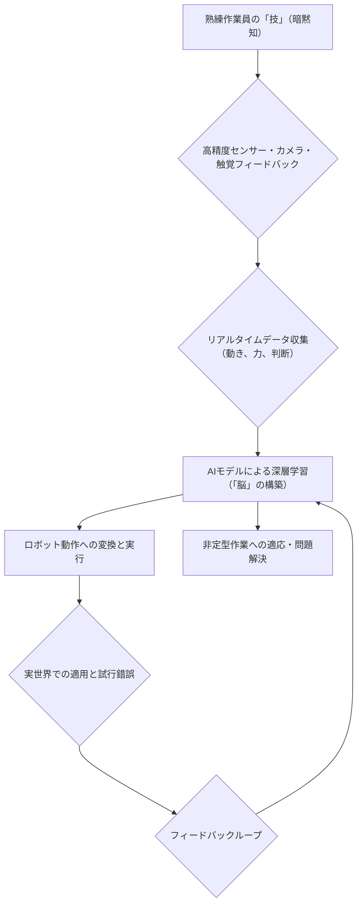

今、シリコンバレーで最も熱い視線が注がれているのは、単なる生成AIの進化ではない。現実世界、つまり「物理空間」におけるAIの応用、特に**AIロボットが人間から「技」を学ぶ**という、まるでSFのような領域だ。先日、Industrial Equipment Newsで報じられた「スタートアップが熟練工の技術を捕捉し、ロボットのAI脳を開発」というニュースは、まさにその最前線を鮮やかに切り取っていた。これは単なるロボットの高性能化といったレベルの話ではない。熟練の職人技、長年の経験に裏打ちされた微妙な感覚や判断といった、これまで人間だけが持ち得た「暗黙知」が、ついにAIの領域へと取り込まれようとしているのだ。この流れは、製造業を筆頭に、これまで自動化が困難とされてきたあらゆる産業に地殻変動をもたらすだろう。

### 「技」のデジタル化：熟練工の神髄をAIへ

これまで産業用ロボットは、その動きを精密にプログラミングすることで成り立ってきた。指定された軌道を正確に、繰り返し実行する。しかし、これはあくまで「指示されたこと」を完璧にこなす能力であり、予期せぬ変化への対応や、人間の持つような微妙な力加減、状況判断といった**「熟練の技」**とは次元が異なる。例えば、たった一つのねじを締めるにしても、素材の固さやねじの摩耗具合によって最適なトルクや締め方は変わる。これを全て事前にプログラミングで網羅するのは事実上不可能だった。

しかし、今回注目されている技術は、この課題を根本から覆す。スタートアップが開発するAIは、熟練作業員が実際に作業を行う様子を、多角的なセンサーや高精度カメラ、触覚フィードバックデバイスなどで徹底的に「観察」し、その動き、力加減、判断のプロセスをデータとして収集する。そして、この膨大なデータを基にAIが学習し、あたかも人間のように「考えて」作業を行うロボットの「脳」を構築するのだ。

このプロセスは、従来のロボット開発とは一線を画す。単に動作を模倣するだけでなく、作業中の「なぜ」をAIが推論し、状況に応じて最適な「解」を導き出す。これにより、ロボットは、これまで自動化が困難だった非定型作業や、微細な調整が必要な組立作業、品質検査、さらにはタイヤ交換やバランス調整といった専門性の高いサービス（Fox NewsやTire Businessで報じられた事例がまさにこれだ）までも、人間同等、あるいはそれ以上の精度でこなせるようになる。

**図：熟練技学習AIロボットの開発ワークフロー**

### ロボットが「考える」時代へ：物理世界での問題解決能力

この「技のデジタル化」がもたらす最大の変革は、ロボットが**「物理世界で問題を解決する能力」**を獲得することにある。ペンシルベニア大学の研究が示すように、「物理世界におけるAI」とは、ロボットアームが様々なツールを使いこなし、予期せぬ状況に直面しても、まるで人間のように試行錯誤しながら最適な解決策を見つける能力を指す。従来のロボットは、あくまで閉鎖された環境下で、与えられたタスクを繰り返す「プログラムされた機械」だった。しかし、熟練技を学習したAIロボットは、例えば少し位置がずれた部品、微妙に形状が異なる材料、あるいは工具の摩耗といった、現実世界で常に発生する「ゆらぎ」に対して、自律的に対応できるようになる。

これは、倉庫内での複雑なピッキング作業（WWDがLocus Roboticsについて報じたように、AIが棚から直接商品を選ぶ）から、製造ラインにおける複雑な組み立て、さらには中国が2029年の月面ミッションで投入を計画するAI搭載月面ロボット（eWeek報道）といった極限環境下での自律作業に至るまで、応用範囲は無限大だ。もはやロボットは単なる「自動機械」ではなく、人間の拡張、あるいは人間の知能と身体性を再現する「自律的な存在」へと変貌を遂げつつある。

編集部で特に注目したのは、この技術が**「汎用性」**を高める点だ。特定の作業のために一からプログラミングするのではなく、人間の熟練技を学習基盤とすることで、異なる製品、異なる工程にもAIモデルを転用しやすくなる。これは、多品種少量生産や、頻繁なモデルチェンジが求められる現代の製造業において、極めて大きなアドバンテージとなる。

### 産業界の変革：生産性向上と人手不足の解消

この技術が産業界にもたらすインパクトは計り知れない。まず挙げられるのは、**生産性の飛躍的な向上**と**人手不足の解消**である。特に日本の製造業は、少子高齢化による労働人口の減少と、熟練技術者の引退に伴う技術継承問題に直面している。このAIロボットは、熟練技術者の持つ貴重な「技」をデジタル化し、次世代へと「継承」するだけでなく、それを24時間365日休むことなく実行可能な労働力へと変換する。

例えば、ミシガン大学が主導する国際研究チームが620万ドルの助成金を得て進める、AIとロボティクスシステムによる造船効率化プロジェクト（AI Insider報道）は、熟練工の高度な溶接や組立技術をAIが学習し、巨大構造物の建造プロセスを最適化する狙いがある。造船業のような大規模かつ複雑な工程でさえ、AIロボットが介入することで、品質の安定化、作業時間の短縮、そして安全性の向上が見込まれるのだ。

以下に、従来のロボットプログラミングと、熟練技学習AIロボットの主な特徴を比較する。

| 特徴            | 従来のロボットプログラミング | 熟練技学習AIロボット  |
| :-------------- | :--------------------------- | :-------------------- |
| 適用可能なタスク | 定型的、反復性の高い作業     | **非定型、複雑、判断を伴う作業** |
| 開発時間        | 長い（詳細なコーディング）   | **短縮（学習ベース）**    |
| 柔軟性          | 低い（変更に弱い）           | **高い（状況適応可能）**      |
| 精度            | 高い（設定値通り）           | **熟練工レベルの微細調整可能** |
| スキル継承      | 間接的（プログラム化）       | **直接的（模倣と再現）**  |
| 初期導入コスト  | 高い                       | 高い（データ収集・AI開発）が、汎用性で回収 |

この比較からも明らかなように、熟練技学習AIロボットは、これまでのロボットが不得手としていた領域をカバーし、産業オートメーションの可能性を大きく広げるものと期待される。これにより、日本の「ものづくり」が再び世界をリードするきっかけになるかもしれない。

### AIロボットの信頼性と安全性：進化するフレームワーク

しかし、高度な知能と身体性を手に入れたAIロボットの導入には、当然ながら課題も伴う。特に重要なのは、その**信頼性と安全性**だ。ロボットが自律的に判断し、物理世界で作業を行う以上、誤動作や予期せぬ挙動は、作業員の安全や製品の品質に直結する。このため、AIの判断の透明性、堅牢性、そして安全なフェイルセーフ機構の確保が不可欠となる。

AZoRoboticsが報じた「多層AI安全フレームワークがロボットの信頼性を向上させる」というニュースは、まさにこの課題への回答の一つだ。複数の安全層を設けることで、AIの判断ミスや予測不可能な事態が発生した場合でも、即座にそれを検知し、安全側に制御を移行させる。これは、人間とロボットが協働する「協働ロボット」の普及を後押しするためにも、極めて重要な技術進化と言えるだろう。

AIロボットが人間の技を学習する過程では、学習データの質、多様性、そして潜在的なバイアスにも注意が必要だ。特定の熟練工の癖や偏りがAIに学習されてしまうと、それがロボットの「個性」として現れ、時に品質のばらつきや特定の状況でのパフォーマンス低下を招く可能性もある。このため、広範なデータを収集し、異なる熟練工の技を統合的に学習させるなど、より洗練されたデータ収集・学習アプローチが求められる。

### 🧐 編集部の辛口オピニオン

今回の「熟練工の技をAIロボットが学習する」というニュースを聞いて、日本の製造業関係者は本当に危機感を感じているだろうか？ 残念ながら、多くの企業はまだ「うちの熟練工の技は、デジタル化できるほど単純じゃない」と高を括っているのではないか。しかし、シリコンバレーのスタートアップは、まさにその「単純じゃない」とされてきた領域にメスを入れ、確実に成果を出し始めている。

問題は、日本企業がこの潮流に対して、これまでのような「様子見」や「部分的な導入」で済ませようとしている点にある。熟練工の高齢化が喫緊の課題であるにもかかわらず、その技術継承はOJTという非効率な方法に依存し、デジタル化への投資は後回しにされがちだ。このAIロボット技術は、単なるコスト削減ツールではない。それは、日本の「ものづくり」の根幹をなす「技」という無形資産を、データという形で未来永劫に継承し、さらに発展させるための**唯一無二の手段**となり得るのだ。

今、日本企業に求められるのは、古い慣習を捨て、熟練工の皆さんに積極的にAIロボットの「先生役」を担ってもらうことだ。彼らの持つ「技」を最高の教材としてAIに学習させ、新しい価値創造のパートナーとしてAIロボットを受け入れる。この意識改革なくして、日本の製造業は国際競争の荒波を乗り越えられないだろう。もし、この動きに乗り遅れれば、数年後には「日本発の熟練技が、海外製のAIロボットによって世界中に普及し、日本の産業は旧態依然としたまま取り残された」という、悪夢のようなシナリオが現実となるかもしれない。もはや時間は残されていない。

## 💡 よくある質問（FAQ）

### Q: 熟練工の「暗黙知」をAIが学習することの具体的なメリットは何ですか？
A: 最も大きなメリットは、これまで属人化され、伝承が困難だった高度な作業技術や判断基準を、AIを通じてロボットが再現可能になる点です。これにより、品質の安定化、生産性の向上、そして熟練工の引退に伴う技術継承問題の解決に貢献します。

### Q: この技術は、どのような産業分野で特に有効だと考えられますか？
A: 高度な手作業や精密な判断が求められる製造業（特に自動車、電子部品、医療機器）、非定型な作業が多い物流・倉庫業、人手不足が深刻な建設業、インフラ点検、さらには災害対応や宇宙開発といった特殊環境下での作業において、その効果が期待されます。

### Q: AIロボットによる熟練技の学習が進むことで、人間の仕事はどのように変化しますか？
A: 単純な反復作業や危険な作業はAIロボットが担うようになるため、人間の役割は、AIロボットの監視・管理、より高度な判断や創造的な作業、そしてAIロボットへの「教師役」へとシフトしていくと考えられます。人間とAIロボットが協働し、それぞれの強みを活かす新しい働き方が主流になるでしょう。

## 🔗 関連ツール・サービス

**[Boston Dynamics Spot](https://www.bostondynamics.com/products/spot)** — 四足歩行ロボット。多様なセンサーとAIで複雑な環境での移動・監視・データ収集が可能。
**[FANUC CRXシリーズ](https://www.fanuc.co.jp/products/robot/crx/index.html)** — 人間と協働できる安全設計のロボット。直感的な操作性で、AI連携による多様な作業自動化に対応。
**[NVIDIA Isaac](https://developer.nvidia.com/isaac-robotics-platform)** — ロボット開発のための包括的なAIプラットフォーム。シミュレーションからデプロイまでを加速。
**[Siemens Xcelerator](https://www.sw.siemens.com/ja-JP/xcelerator/)** — デジタルツイン技術を核に、AIやIoTを組み合わせて製造業のDXを推進するオープンデジタルビジネスプラットフォーム。